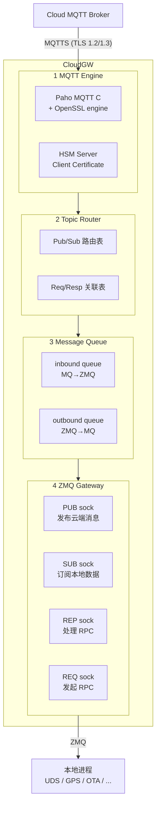
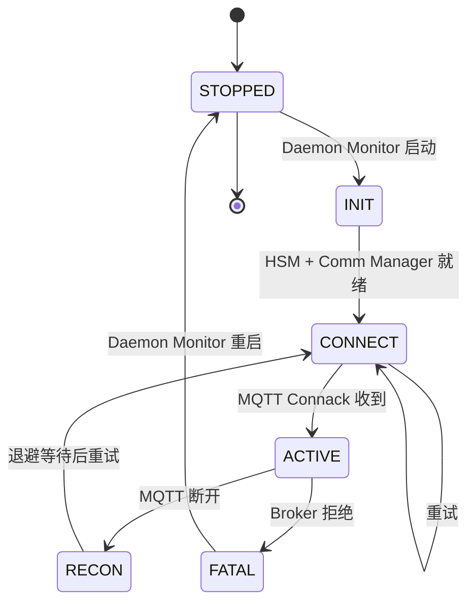

# CloudGW — 云端网关应用设计

> CloudGW 是 TBox 与云端 MQTT Broker 通信的**单一网关进程**，运行于 SoC Linux 用户空间。
> 它是中间件服务 3.6 MQTTS Client 的具体实现，向下通过 HSM Server 完成 TLS 握手，
> 向上通过 **ZeroMQ** 与所有本地进程交换数据，MQTT 侧与 ZeroMQ 侧之间由**消息队列**桥接。

---

## 1. 应用架构总览

```
                         Cloud MQTT Broker
                              │ MQTTS (TLS 1.2/1.3)
                              │ Client Certificate via HSM
                              ▼
┌──────────────────────────────────────────────────────────────┐
│                        CloudGW                                │
│                                                               │
│  ┌──────────────────────────────────────────────────────────┐ │
│  │  ① MQTT 引擎层 (MQTT Engine)                               │ │
│  │  Paho MQTT C / mosquitto lib + OpenSSL engine → HSM Server│ │
│  │  职责: Broker 连接、心跳、订阅、发布、重连                    │ │
│  └──────────┬───────────────────────────────────────────────┘ │
│             │  MQTT 消息 (Topic + Payload)                    │
│             ▼                                                  │
│  ┌──────────────────────────────────────────────────────────┐ │
│  │  ② Topic 路由层 (Topic Router + Codec)                     │ │
│  │  职责: MQTT Topic ⇄ ZMQ Topic 映射 / 序列化 / 请求应答关联 │ │
│  │  ┌──────────────────┐  ┌───────────────────────────────┐  │ │
│  │  │ Pub/Sub 路由表    │  │ Req/Resp 关联表 (RPC-ID 映射) │  │ │
│  │  └──────────────────┘  └───────────────────────────────┘  │ │
│  └──────────┬───────────────────────────────────────────────┘ │
│             │  路由后的内部消息                                  │
│             ▼                                                  │
│  ┌──────────────────────────────────────────────────────────┐ │
│  │  ③ 消息队列 (Message Queue Bridge)                         │ │
│  │  职责: 解耦 MQTT 线程与 ZMQ 线程，异步传递                    │ │
│  │  ┌────────────────────┐ ┌──────────────────────────────┐  │ │
│  │  │  inbound queue     │ │  outbound queue               │  │ │
│  │  │  (MQ→ZMQ 出队线程) │ │  (ZMQ→MQ 入队线程)            │  │ │
│  │  └────────────────────┘ └──────────────────────────────┘  │ │
│  └──────────┬───────────────────────────────────────────────┘ │
│             │  队列消息 (内部格式)                               │
│             ▼                                                  │
│  ┌──────────────────────────────────────────────────────────┐ │
│  │  ④ ZeroMQ 网关层 (ZMQ Gateway)                            │ │
│  │  职责: 跨进程发布云消息 / 接收本地数据 / 处理 RPC           │ │
│  │  ┌──────────┐ ┌──────────┐ ┌──────────┐ ┌──────────────┐ │ │
│  │  │ PUB sock │ │ SUB sock │ │ REP sock │ │ REQ sock     │ │ │
│  │  │ (发布云  │ │ (订阅本  │ │ (处理RPC │ │ (发起RPC请求 │ │ │
│  │  │  端消息) │ │  地数据) │ │  请求)   │ │  到本地服务)  │ │ │
│  │  └──────────┘ └──────────┘ └──────────┘ └──────────────┘ │ │
│  └──────────────────────────────────────────────────────────┘ │
└──────────────────────────┬───────────────────────────────────┘
                           │ ZeroMQ (跨进程)
                           │
         ┌─────────────────┼──────────────────────┐
         │                 │                       │
         ▼                 ▼                       ▼
   ┌────────────┐  ┌──────────────┐  ┌──────────────────────┐
   │ UDS Server │  │ GPS Daemon   │  │ 其他本地进程          │
   │ (诊断结果)  │  │ (位置上报)   │  │ (日志 / 状态 / OTA)   │
   │ ZMQ PUB    │  │ ZMQ PUB     │  │ ZMQ PUB/REQ          │
   └────────────┘  └──────────────┘  └──────────────────────┘
```



## 2. 四层架构详解

### 2.1 MQTT 引擎层（MQTT Engine）

**硬件依赖链**：`net.cellular` / `net.eth` / `net.wifi` → `security.hsm`

```
Comm Manager ──链路状态通知──→ CloudGW MQTT Engine
                                    │
                            ┌───────┴──────────┐
                            │  MQTT Client       │
                            │  (Paho MQTT C)     │
                            │  ┌──────────────┐  │
                            │  │ 连接管理       │  │
                            │  │ Keep-Alive    │  │
                            │  │ Last Will     │  │
                            │  │ 自动重连       │  │
                            │  └──────────────┘  │
                            └───────┬──────────┘
                                    │ OpenSSL engine
                                    ▼
                            ┌───────┴──────────┐
                            │  TLS 1.2/1.3      │
                            │  + HSM Client     │
                            │  Cert (IPC)       │
                            │  ←→ HSM Server    │
                            └──────────────────┘
```

- **MQTT 协议版本**：MQTT v3.1.1 / v5.0
- **客户端库**：Paho MQTT C (`libpaho-mqtt3as`) 或 mosquitto lib
- **TLS 接入方式**：
  ```c
  // OpenSSL engine 接入 HSM Server 的 PKCS#11 接口
  ENGINE_load_builtin_engines();
  ENGINE *e = ENGINE_by_id("pkcs11");
  ENGINE_ctrl_cmd_string(e, "MODULE_PATH", "/usr/lib/libpkcs11-hsm.so", 0);
  SSL_CTX_set_client_cert_engine(ctx, e);
  ```
- **Last Will**：`tbox/status` 主题发布 `offline` 遗嘱消息
- **心跳策略**：30s Keep-Alive，指数退避重连（1s → 5s → 30s → 60s cap）

#### 关键配置

| 配置项 | 值 | 来源 |
|--------|-----|------|
| Broker URL | `mqtts://{cloud-endpoint}:8883` | 配置文件 / OTA 下发 |
| Client ID | `TBOX-{设备序列号}` | 设备证书 CN |
| TLS 版本 | TLS 1.2 / 1.3 | OpenSSL + HSM |
| Client Certificate | `pkcs11:token=HSM;object=dev-cert` | HSM Key-0 |
| CA Certificate | 预置 / OTA 更新 | eMMC 证书分区 |
| Keep Alive | 30 秒 | 固定 |
| Clean Session | false (QoS 1/2 持久会话) | 配置 |
| 遗嘱 Topic | `tbox/{device_id}/status` | 固定 |
| 遗嘱 Payload | `offline` | QoS 1, retain |

---

### 2.2 Topic 路由层（Topic Router + Codec）

**职责**：在 MQTT Topic 与 ZMQ 内部通道之间建立双向映射关系，并处理请求应答的关联。

#### 2.2.1 Topic 映射表

MQTT Topic 采用 `tbox/{device_id}/{direction}/{type}/{subtype}` 层级结构。

| MQTT Topic | 方向 | ZMQ 通道 | 消息模式 | Payload 格式 |
|-----------|------|---------|---------|-------------|
| `tbox/{id}/up/telemetry` | 上报 | `pub:telemetry` | PUB | CBOR (JSON) |
| `tbox/{id}/up/diag` | 上报 | `pub:diag` | PUB | CBOR |
| `tbox/{id}/up/gps` | 上报 | `pub:gps` | PUB | CBOR |
| `tbox/{id}/up/log` | 上报 | `pub:log` | PUB | CBOR |
| `tbox/{id}/up/status` | 上报 | `pub:status` | PUB | CBOR |
| `tbox/{id}/down/command` | 下发 | `sub:command` | SUB | CBOR (JSON) |
| `tbox/{id}/down/config` | 下发 | `sub:config` | SUB | CBOR (JSON) |
| `tbox/{id}/down/ota` | 下发 | `sub:ota` | SUB | CBOR |
| `tbox/{id}/rpc/+/request` | 请求 | `rep:{method}` | REQ/REP | CBOR (RPC) |
| `tbox/{id}/rpc/+/response` | 响应 | `rep:{method}` | REQ/REP | CBOR (RPC) |

#### 2.2.2 请求-应答模式（RPC via MQTT）

```
本地进程                           CloudGW                         Cloud Broker
   │                                │                                │
   │  ZMQ REQ: get_dtc              │                                │
   │ ──────────────────────────────→│                                │
   │                                │  MQTT PUB: tbox/{id}/rpc/      │
   │                                │  get_dtc/request               │
   │                                │ ──────────────────────────────→│
   │                                │                                │
   │                                │  MQTT SUB: tbox/{id}/rpc/      │
   │                                │  get_dtc/response              │
   │                                │ ←──────────────────────────────│
   │  ZMQ REP: {dtc_list}           │                                │
   │ ←──────────────────────────────│                                │
```

- **关联机制**：每个 RPC 请求携带 `correlationId`（UUID v4），放在 CBOR 头部
- **超时**：30 秒若无响应则返回超时错误

---

### 2.3 消息队列桥接（Message Queue Bridge）

**职责**：在 MQTT 线程上下文与 ZMQ 线程上下文之间异步传递消息，避免锁竞争。

```
MQTT Engine Thread                 Message Queue                  ZMQ Gateway Thread
     │                                  │                              │
     │ MQ消息入队                        │                              │
     │ (MQ→ZMQ queue)                   │                              │
     │ ────────────────────────────────→│                              │
     │                                  │  出队 → 路由 → ZMQ PUB      │
     │                                  │ ────────────────────────────→│
     │                                  │                              │
     │                                  │  ZMQ SUB → 入队             │
     │                                  │ ←────────────────────────────│
     │ ZMQ消息入队                      │                              │
     │ (ZMQ→MQ queue)                   │                              │
     │ ←────────────────────────────────│                              │
     │                                  │                              │
     │  出队 → Topic映射 → MQTT PUB    │                              │
```

#### 队列实现

| 队列 | 方向 | 数据结构 | 容量 | 阻塞策略 |
|------|------|---------|------|---------|
| `mq_to_zmq` | MQTT → ZMQ | 无锁 SPSC ring buffer | 4096 条 | 满则丢弃最低优先级 |
| `zmq_to_mq` | ZMQ → MQTT | 无锁 SPSC ring buffer | 4096 条 | 满则阻塞 ZMQ 侧 |

#### 消息内部格式

```
┌─────────┬──────────┬──────────┬──────────┬─────────────┬──────────┐
│ src     │ dst      │ qos      │ retain   │ topic_len   │ topic    │
│ uint8   │ uint8    │ uint8    │ bool     │ uint16      │ bytes    │
├─────────┼──────────┼──────────┼──────────┼─────────────┼──────────┤
│ payload_len         │  payload              │ timestamp │ priority │
│ uint32              │  bytes                │ uint64    │ uint8    │
└─────────────────────┴──────────────────────┴───────────┴──────────┘
```

---

### 2.4 ZeroMQ 网关层（ZMQ Gateway）

**硬件依赖链**：`cpu`（进程间通信，无需额外硬件）

#### 2.4.1 Socket 拓扑

```
┌─────────────────────────────────────────────────────┐
│                   CloudGW                             │
│                                                       │
│  ZMQ PUB (ipc:///tmp/tbox_cgw_pub.ipc)                │
│    └── 发布云端下行消息（telemetry_rsp/command/...） │
│                                                       │
│  ZMQ SUB (ipc:///tmp/tbox_cgw_sub.ipc)                │
│    ├── 订阅本地数据上报（telemetry/diag/gps/log）    │
│    ├── filter: "telemetry" "diag" "gps" "log"        │
│                                                       │
│  ZMQ REP (ipc:///tmp/tbox_cgw_rep.ipc)                │
│    └── 处理本地 RPC 请求（get_dtc/set_config/...）   │
│                                                       │
│  ZMQ REQ (ipc:///tmp/tbox_cgw_req.ipc)                │
│    └── 向本地服务发起 RPC（HSM签名/存储查询/...）    │
└─────────────────────────────────────────────────────┘
```

- **传输方式**：`ipc:///tmp/tbox_cgw_*.ipc`（同机跨进程，Unix Domain Socket）
- **编码**：ZMQ 多帧消息（`[channel][payload]`）

#### 2.4.2 ZMQ 消息协议

```
Frame 0: channel   (字符串, 如 "telemetry" "diag" "command")
Frame 1: payload   (CBOR 二进制)
Frame 2: timestamp (uint64, 可选)
```

#### 2.4.3 本地进程连接规范

任何需要与 CloudGW 通信的本地进程，需按照以下模式连接：

```c
// 本地发布数据到云端（PUB → ZMQ SUB → CloudGW → MQTT PUB）
void *pub = zmq_socket(ctx, ZMQ_PUB);
zmq_connect(pub, "ipc:///tmp/tbox_cgw_sub.ipc");  // 连接到 CloudGW SUB
zmq_send(pub, "telemetry", 9, ZMQ_SNDMORE);
zmq_send(pub, cbor_data, cbor_len, 0);

// 本地订阅云端消息（ZMQ SUB ← CloudGW PUB）
void *sub = zmq_socket(ctx, ZMQ_SUB);
zmq_connect(sub, "ipc:///tmp/tbox_cgw_pub.ipc");  // 连接到 CloudGW PUB
zmq_setsockopt(sub, ZMQ_SUBSCRIBE, "command", 7);
// 轮询接收...

// 本地发起 RPC（ZMQ REQ → CloudGW REP）
void *req = zmq_socket(ctx, ZMQ_REQ);
zmq_connect(req, "ipc:///tmp/tbox_cgw_rep.ipc");  // 连接到 CloudGW REP
zmq_send(req, "get_dtc", 7, ZMQ_SNDMORE);
zmq_send(req, params, params_len, 0);
zmq_recv(req, &rsp, 0);
```

---

## 3. 核心数据流

### 3.1 数据上报流（Local → Cloud）

```
UDS Server                     CloudGW                            Cloud
(ZMQ PUB)                      (ZMQ SUB → MQ → MQTT Engine)       (MQTT Broker)
    │                             │                                  │
    │ PUB "diag" {DTC结果}       │                                  │
    │ ──────────────────────────→│                                  │
    │                             │ 入队 zmq_to_mq queue             │
    │                             │ 出队 → Topic路由                │
    │                             │ 映射: diag → tbox/{id}/up/diag │
    │                             │ MQTT PUB (QoS 1)                │
    │                             │ ───────────────────────────────→│
    │                             │                                  │
```

### 3.2 远程指令流（Cloud → Local）

```
Cloud                            CloudGW                            UDS Server
(MQTT Broker)                   (MQTT SUB → MQ → ZMQ PUB)           (ZMQ SUB)
    │                             │                                  │
    │ MQTT PUB: tbox/{id}/       │                                  │
    │ down/command {remote_diag}  │                                  │
    │ ──────────────────────────→│                                  │
    │                             │ 入队 mq_to_zmq queue             │
    │                             │ 出队 → Topic路由                │
    │                             │ 映射: command → command         │
    │                             │ ZMQ PUB "command"               │
    │                             │ ───────────────────────────────→│
    │                             │                                  │
```

### 3.3 RPC 请求流（Local → Cloud → Cloud → Local）

```
Local Process                  CloudGW                            Cloud
(ZMQ REQ)                      (ZMQ REP → MQ → MQTT Engine)       (MQTT Broker)
    │                             │                                  │
    │ REQ "get_dtc" {vin}        │                                  │
    │ ──────────────────────────→│                                  │
    │                             │ 分配 correlationId              │
    │                             │ 入队 zmq_to_mq queue             │
    │                             │ MQTT PUB tbox/{id}/rpc/         │
    │                             │ get_dtc/request                 │
    │                             │ ───────────────────────────────→│
    │                             │                                  │
    │                             │ MQTT SUB tbox/{id}/rpc/         │
    │                             │ get_dtc/response                │
    │                             │ ←───────────────────────────────│
    │                             │ 匹配 correlationId              │
    │                             │ 入队 mq_to_zmq queue             │
    │ REP {dtc_list}              │                                  │
    │ ←──────────────────────────│                                  │
```

---

## 4. CloudGW 状态机

```
                    ┌───────────┐
                    │  STOPPED  │
                    └─────┬─────┘
                          │ Daemon Monitor 启动
                          ▼
                    ┌───────────┐
                    │  INIT     │ ← 初始化 ZMQ 套接字 + 消息队列
                    └─────┬─────┘
                          │ HSM Server 就绪 + Comm Manager 链路就绪
                          ▼
                    ┌───────────┐
              ┌────→│  CONNECT  │ ← 发起 MQTTS 连接
              │     └─────┬─────┘
              │           │ MQTT Connack 收到
              │           ▼
              │     ┌───────────┐
              │     │  ACTIVE   │ ← 收发数据
              │     └─────┬─────┘
              │           │
              │      ┌────┴────┐
              │      │         │
              │   MQTT     Broker
              │  断开      拒绝
              │      │         │
              │      ▼         ▼
              │  ┌────────┐  ┌────────┐
              │  │ RECON  │  │ FATAL  │
              │  │ 重连中  │  │ 不可恢复│
              │  └───┬────┘  └────────┘
              │      │             │ Daemon Monitor 重启
              └──────┘             │
                                   ▼
                             ┌───────────┐
                             │  STOPPED  │
                             └───────────┘
```



---

## 5. 依赖关系

### 5.1 硬件依赖（引用 `hardware.md` 能力 ID）

| 依赖项 | 能力 ID | 用途 | 重要性 |
|--------|---------|------|--------|
| 4G / Ethernet / WiFi | `net.cellular`, `net.eth`, `net.wifi` | MQTT Broker TCP 连接 | 关键 |
| HSM 芯片 | `security.hsm` | TLS 客户端证书私钥签名 | 关键 |
| SPI (HSM 通道) | `serial.spi` | HSM Server ←→ HSM 芯片通信 | 间接关键 |
| CPU | `cpu` | 进程运行 / ZMQ 消息处理 | 基础 |
| eMMC | `storage.emmc` | 证书 / 配置持久化 | 重要 |

### 5.2 中间件服务依赖（引用 `middleware.md` 服务）

| 依赖服务 | 中间件章节 | 交互方式 | 用途 |
|---------|-----------|---------|------|
| HSM Server | 3.5 | IPC (UNIX Domain Socket) | TLS 签名 / 证书读取 |
| Comm Manager | 3.3 | IPC (链路状态通知) | 网络链路可用性监测 |
| Daemon Monitor | 3.1 | signal / IPC | 生命周期管理 / 崩溃重启 |
| (本地进程) UDS Server | 3.4 | ZeroMQ PUB/REQ | 诊断数据上报 / RPC |
| (本地进程) GPS Daemon | 3.8 Time Sync | ZeroMQ PUB | GPS 位置上报 |
| (本地进程) OTA Agent | 3.9 | ZeroMQ SUB/REP | OTA 指令接收 |

### 5.3 依赖关系图

```
┌──────────────────────────────────────────────────────────────┐
│  hardware.md                  middleware.md                   │
│  ┌──────────┐                 ┌──────────────────┐           │
│  │ HSM Chip │──SPI/I2C──→    │ HSM Server (3.5) │──IPC──┐   │
│  └──────────┘                 └──────────────────┘       │   │
│                                                           │   │
│  ┌──────────┐                 ┌──────────────────┐       │   │
│  │ 4G/WiFi  │──USB/SDIO──→   │Comm Mgr (3.3)    │──IPC──┤   │
│  │ /Ethernet│                 │(链路状态)        │       │   │
│  └──────────┘                 └──────────────────┘       │   │
│                                                           ├──→ CloudGW
│  ┌──────────┐                 ┌──────────────────┐       │   │
│  │ CPU+eMMC │──CPU BIST──→   │Daemon Monitor(3.1)│──sig─┤   │
│  └──────────┘                 └──────────────────┘       │   │
│                                                           │   │
│  ┌──────────┐                 ┌──────────────────┐       │   │
│  │ CAN Bus  │──MCU-SPI──→    │UDS Server (3.4)  │──ZMQ──┘   │
│  └──────────┘                 └──────────────────┘           │
└──────────────────────────────────────────────────────────────┘
```

---

## 6. Topic 定制规范

### 6.1 命名规则

```
tbox/{device_id}/{direction}/{type}[/{subtype}][/{rpc_method}]
```

| 段 | 说明 | 示例 |
|----|------|------|
| `tbox` | 固定前缀 | `tbox` |
| `{device_id}` | 设备唯一标识 | `TBOX-AF123456` |
| `{direction}` | `up` / `down` / `rpc` | `up` |
| `{type}` | 消息分类 | `telemetry` `diag` `gps` `log` `status` `command` `config` `ota` |
| `{subtype}` | 子分类（可选） | `periodic` `event` |
| `{rpc_method}` | RPC 方法名（仅 rpc 方向） | `get_dtc` `set_config` `remote_diag` |

### 6.2 完整 Topic 清单

| # | Topic | 方向 | QoS | Retain | 说明 |
|---|-------|------|-----|--------|------|
| 1 | `tbox/{id}/up/telemetry` | 上报 | 1 | ✗ | 周期性车辆状态数据 |
| 2 | `tbox/{id}/up/diag` | 上报 | 1 | ✗ | 诊断结果 / DTC |
| 3 | `tbox/{id}/up/gps` | 上报 | 1 | ✗ | GPS 位置 / 时间 |
| 4 | `tbox/{id}/up/log` | 上报 | 0 | ✗ | 日志批量上报 |
| 5 | `tbox/{id}/up/status` | 上报 | 1 | ✓ | 在线/离线/启动/休眠 |
| 6 | `tbox/{id}/down/command` | 下发 | 1 | ✗ | 远程指令 |
| 7 | `tbox/{id}/down/config` | 下发 | 1 | ✓ | 远程配置更新 |
| 8 | `tbox/{id}/down/ota` | 下发 | 2 | ✗ | OTA 升级通知 |
| 9 | `tbox/{id}/rpc/{method}/request` | RPC 请求 | 1 | ✗ | 远程过程调用请求 |
| 10 | `tbox/{id}/rpc/{method}/response` | RPC 响应 | 1 | ✗ | 远程过程调用响应 |
| 11 | `tbox/{id}/will` | 遗嘱 | 1 | ✓ | Last Will（离线通知） |

### 6.3 Payload 格式

所有 Topic 的 Payload 统一使用 **CBOR** 编码（RFC 7049）。

```
CBOR 根 Map:
{
  "v": 1,                // 版本
  "ts": 1715702400.123,   // 时间戳 (unix seconds.micros)
  "id": "msg-uuid",       // 消息唯一 ID
  "data": { ... },        // 业务数据
  "sig": "base64..."      // 可选, HSM 签名
}
```

对于 `rpc` 方向，额外字段：

```
{
  "v": 1,
  "ts": 1715702400.123,
  "id": "req-uuid",
  "method": "get_dtc",
  "correlationId": "req-uuid-123",
  "params": { ... },    // request 侧
  "result": { ... },    // response 侧
  "error": null
}
```

---

## 7. 进程生命周期

由 Daemon Monitor（middleware.md 3.1）管理 CloudGW 进程：

```
启动顺序：
  1. HSM Server (3.5)       ← 必须先就绪
  2. Comm Manager (3.3)     ← 网络链路
  3. CloudGW                 ← 依赖上两者
  4. UDS Server / OTA Agent ← 不直接依赖 CloudGW

停止顺序（反向）：
  1. CloudGW 发送 will + 断开 MQTTS
  2. CloudGW 停止 ZMQ 套接字
  3. 清理消息队列
```

**健康检查**：
- Daemon Monitor 通过 ZMQ REQ 向 CloudGW 发送 `health` 请求
- CloudGW 在 1s 内返回 `{status: "ok", mqtt: "connected", uptime: 1234}`
- 连续 3 次超时 → Daemon Monitor SIGTERM → 重启

---

## 8. 配置存储

CloudGW 配置持久化在 eMMC 分区：

| 配置项 | 路径 | 格式 | 更新方式 |
|--------|------|------|---------|
| Broker 地址 | `/etc/tbox/cloudgw/broker.conf` | TOML | 预置 / OTA 下发 |
| 设备证书引用 | `/etc/tbox/cloudgw/hsm_slots.conf` | TOML | 预置 |
| Topic 映射表 | `/etc/tbox/cloudgw/topic_map.conf` | TOML | OTA 下发 |
| ZMQ 端口 | `/etc/tbox/cloudgw/zmq.conf` | TOML | 预置 |

---

## 9. 修订记录

| 版本 | 日期 | 修改内容 | 修改人 |
|------|------|---------|--------|
| v0.1 | — | 初版 CloudGW 架构设计（MQTT Engine + Topic Router + Message Queue + ZMQ Gateway 四层） | — |
