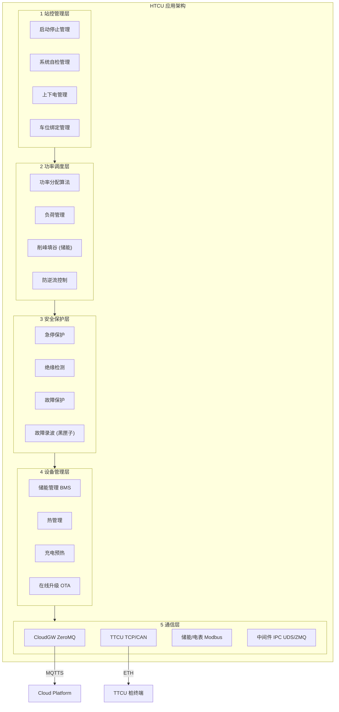

# HTCU — 充电桩站点主控应用设计

> HTCU (Host TCU) 是充电桩**场站级主控应用**，运行于 SoC Linux 用户空间，作为整个充电站的大脑。
> 它连接云平台（通过 CloudGW）、管理多台 TTCU 桩终端、协调储能系统、执行功率调度与安全保护。
> **角色定位**：站级管理平台，不直接控制充电枪，通过 TTCU 下发桩级指令。

---

## 1. 系统角色定位

```
                    ┌────────────────────────────────┐
                    │     Cloud OCPP Platform        │
                    │  (运营平台 / 鉴权 / 计费)       │
                    └──────────────┬─────────────────┘
                                   │ MQTTS (CloudGW)
                                   ▼
┌────────────────────────────────────────────────────────────────┐
│                      HTCU (站级主控)                           │
│                                                                │
│  职责范围：充电站运营管理、功率调度、储能协调、安全保护           │
│  运行平台：SoC Linux（ARM Cortex-A）                            │
│  通信对象：CloudGW / TTCU群 / 储能BMS / 电表 / 平台            │
│                                                                │
│  ┌──────────────┐  ┌──────────────┐  ┌──────────────────────┐  │
│  │  站控管理      │  │  功率调度    │  │  储能管理              │  │
│  ├──────────────┤  ├──────────────┤  ├──────────────────────┤  │
│  │  安全保护      │  │  热管理      │  │  鉴权认证              │  │
│  ├──────────────┤  ├──────────────┤  ├──────────────────────┤  │
│  │  故障录波      │  │  心跳保活    │  │  即插即充              │  │
│  └──────────────┘  └──────────────┘  └──────────────────────┘  │
│                                                                │
└──────────────────────┬─────────────────────────────────────────┘
          │                            │
          │ Ethernet / CAN             │ Modbus / CAN
          ▼                            ▼
┌──────────────────┐      ┌────────────────────────┐
│  TTCU 桩终端 xN   │      │  储能系统 / BMS / 电表  │
│  (充放电执行层)   │      │  (站级外围设备)          │
└──────────────────┘      └────────────────────────┘
```

---

## 2. 总体架构

```
┌──────────────────────────────────────────────────────────────────┐
│                     HTCU 应用架构                                  │
│                                                                   │
│  ┌──────────────────────────────────────────────────────────────┐ │
│  │  ① 站控管理层                                                  │ │
│  │  ┌──────────┐ ┌──────────┐ ┌──────────┐ ┌──────────────────┐│ │
│  │  │ 启动停止  │ │ 系统自检  │ │ 上下电   │ │ 车位绑定         ││ │
│  │  │ 管理     │ │ 管理     │ │ 管理     │ │ 管理             ││ │
│  │  └──────────┘ └──────────┘ └──────────┘ └──────────────────┘│ │
│  └──────────────────────────┬───────────────────────────────────┘ │
│                             ▼                                     │
│  ┌──────────────────────────────────────────────────────────────┐ │
│  │  ② 功率调度层                                                  │ │
│  │  ┌──────────┐ ┌──────────┐ ┌──────────┐ ┌──────────────────┐│ │
│  │  │ 功率分配  │ │ 负荷管理  │ │ 削峰填谷 │ │ 防逆流           ││ │
│  │  │ 算法     │ │          │ │ (储能)   │ │ 控制             ││ │
│  │  └──────────┘ └──────────┘ └──────────┘ └──────────────────┘│ │
│  └──────────────────────────┬───────────────────────────────────┘ │
│                             ▼                                     │
│  ┌──────────────────────────────────────────────────────────────┐ │
│  │  ③ 安全保护层                                                  │ │
│  │  ┌──────────┐ ┌──────────┐ ┌──────────┐ ┌──────────────────┐│ │
│  │  │ 急停保护  │ │ 绝缘检测  │ │ 故障保护  │ │ 故障录波         ││ │
│  │  │          │ │          │ │          │ │ (黑匣子)         ││ │
│  │  └──────────┘ └──────────┘ └──────────┘ └──────────────────┘│ │
│  └──────────────────────────┬───────────────────────────────────┘ │
│                             ▼                                     │
│  ┌──────────────────────────────────────────────────────────────┐ │
│  │  ④ 设备管理层                                                  │ │
│  │  ┌──────────┐ ┌──────────┐ ┌──────────┐ ┌──────────────────┐│ │
│  │  │ 储能管理  │ │ 热管理   │ │ 充电预热  │ │ 在线升级(OTA)    ││ │
│  │  │ BMS通信  │ │ (风机/   │ │ (电池预热)│ │ (调用OTA Agent)  ││ │
│  │  │          │ │ 液泵)    │ │          │ │                  ││ │
│  │  └──────────┘ └──────────┘ └──────────┘ └──────────────────┘│ │
│  └──────────────────────────────────────────────────────────────┘ │
│                                                                   │
│  ┌──────────────────────────────────────────────────────────────┐ │
│  │  ⑤ 通信层                                                      │ │
│  │  ┌──────────┐ ┌──────────┐ ┌──────────┐ ┌──────────────────┐│ │
│  │  │ CloudGW  │ │ TTCU     │ │ 储能/电表 │ │ 中间件IPC        ││ │
│  │  │ ZeroMQ   │ │ TCP/CAN  │ │ Modbus   │ │ UDS/ZMQ          ││ │
│  │  └──────────┘ └──────────┘ └──────────┘ └──────────────────┘│ │
│  └──────────────────────────────────────────────────────────────┘ │
│                                                                   │
└──────────────────────────────────────────────────────────────────┘
```



### 3.1 停车启动与关闭

| 流程 | 说明 |
|------|------|
| **冷启动** | 系统上电 → 自检 → 加载配置 → 注册到云平台 → 就绪 |
| **热启动** | 异常重启后恢复运行中状态，恢复功率分配上下文 |
| **安全关机** | 停止所有充电任务 → 储能系统下电 → 保存故障录波 → 通知平台 |
| **低功耗待机** | 无充电任务时进入低功耗模式，PMIC 控制电源轨 |

**依赖**：`power.pmic` → Daemon Monitor → HTCU 进程生命周期

### 3.2 充电系统自检（Startup Self-Check）

上电后执行的系统完整性检查：

```
┌──────────────────────────────────────────────┐
│  PowerOnSelfTest()                             │
│                                                │
│  ① TTCU 在线检测（ping 所有注册的桩终端）       │
│  ② 储能 BMS 通信检测（CAN/Modbus）             │
│  ③ 绝缘检测仪通信检测                          │
│  ④ 电表通信检测                                │
│  ⑤ 急停回路状态读取（GPIO）                    │
│  ⑥ CloudGW 连接状态检测（IPC→CloudGW）         │
│  ⑦ OTA Agent 版本检查                          │
│  ⑧ 汇总自检结果 → 上报云平台                    │
└──────────────────────────────────────────────┘
```

**依赖**：`can.bus`、`serial.rs485`、`net.eth`、`net.cellular`

### 3.3 主机上下电管理

控制充电站主电源接触器/断路器的合闸与分闸：

```
┌──────────────────────────────────────────────┐
│  PowerControl                                  │
│                                                │
│  上电条件：                                     │
│  ├─ 急停未触发                                  │
│  ├─ 绝缘检测通过                                │
│  ├─ 储能系统状态正常                            │
│  ├─ 无故障标志                                  │
│  └─ 云平台允许运行                              │
│                                                │
│  下电条件：                                     │
│  ├─ 所有充电任务已停止                           │
│  ├─ 储能系统已断开                              │
│  ├─ 故障录波已保存                              │
│  └─ 已通知云平台                                │
└──────────────────────────────────────────────┘
```

**依赖**：`can.bus`（MCU → 接触器控制）、`power.pmic`

### 3.4 储能自检与充放电管理

```
┌──────────────────────────────────────────────┐
│  EnergyStorageManager                          │
│                                                │
│  ① 定期轮询 BMS 状态（SOC/SOH/温度/电压）       │
│  ② 充放电策略：削峰填谷 / 需量管理 / 光伏匹配   │
│  ③ 保护逻辑：过充/过放/过温/过流自动切断        │
│  ④ 与功率调度联动：储能功率 = 站总功率 - 充电功率 │
│  ⑤ 异常告警上报云平台                           │
└──────────────────────────────────────────────┘
```

**依赖**：`can.bus`（BMS CAN）/ `serial.rs485`（Modbus 储能 PCS）

### 3.5 认证鉴权

支持多种启动方式：

| 方式 | 流程 | 依赖 |
|------|------|------|
| **刷卡启停** | RFID 读卡 → 本地白名单/云端鉴权 → 授权充电 | `serial.rs485` → RFID 读头 |
| **App 扫码** | 用户扫码 → App 请求云平台 → 云平台下发指令 → HTCU 启动充电 | `net.*` → CloudGW |
| **即插即充** | 插枪 → BMS 通信识别车辆 VIN → 自动鉴权 → 启动 | `can.bus` → BMS |
| **离线授权** | 网络异常时本地白名单鉴权，网络恢复后同步 | `storage.emmc` → 本地白名单 |

### 3.6 安全保护功能

```
┌──────────────────────────────────────────────────────────────────┐
│  SafetyManager                                                    │
│                                                                   │
│  ┌──────────────┐  ┌──────────────┐  ┌────────────────────────┐  │
│  │ 急停检测       │  │ 绝缘监测      │  │ 故障保护                │  │
│  │ (GPIO 中断)   │  │ (绝缘检测仪)  │  │ (过流/过压/漏电/过温)  │  │
│  │              │  │              │  │                       │  │
│  │ 触发 → 立即   │  │ 超标 → 告警   │  │ 触发 → 分级处理：      │  │
│  │ 断开所有接触器 │  │ 严重 → 禁止   │  │ 1. 限功率              │  │
│  │ 上报云平台     │  │ 启动充电      │  │ 2. 停止单桩            │  │
│  │ 保存故障录波   │  │              │  │ 3. 全站停机            │  │
│  └──────────────┘  └──────────────┘  └────────────────────────┘  │
│                                                                   │
│  **硬件路径**：                                                  │
│  急停 → GPIO → SoC (HTCU) → CAN/ETH → TTCU → 接触器              │
│  绝缘检测仪 → RS485 → SoC (HTCU)                                  │
└──────────────────────────────────────────────────────────────────┘
```

**依赖**：`gpio`（急停信号）、`serial.rs485`（绝缘检测仪）、`can.bus`（断开指令）

### 3.7 心跳保活

```
┌──────────────────────────────────────────────┐
│  HeartbeatManager                             │
│                                                │
│  ① 云平台心跳：定时发送站状态到 OCPP 平台       │
│     (1秒周期定时器 → CloudGW → MQTTS)          │
│  ② TTCU 心跳监控：监听各桩终端的心跳上报        │
│     (5秒超时判定 → 标记离线 → 分配不可用)       │
│  ③ 储能 BMS 心跳：BMS 离线 → 停止充放电操作     │
│  ④ 自身存活：向 Daemon Monitor 上报健康状态     │
└──────────────────────────────────────────────┘
```

**依赖**：`time.rtc`（心跳时间戳）、`net.*`（CloudGW 通道）

### 3.8 故障录波（黑匣子）

```
┌──────────────────────────────────────────────┐
│  FaultRecorder                                 │
│                                                │
│  触发条件：                                     │
│  ├─ 急停按下                                    │
│  ├─ 绝缘故障                                    │
│  ├─ 过流/过压/漏电跳闸                           │
│  ├─ 通信中断 (TTCU/BMS/Cloud)                   │
│  └─ OTA 升级失败                                │
│                                                │
│  记录内容：                                     │
│  ├─ 时间戳 (UTC + PPS)                          │
│  ├─ 各桩状态快照 (电压/电流/功率/SOC)           │
│  ├─ 储能系统状态                                 │
│  ├─ 电网侧电气参数                               │
│  ├─ 急停/故障 GPIO 状态                         │
│  └─ 前后 30 秒的 CAN 日志帧片段                  │
│                                                │
│  存储：NAND 循环日志 (UBIFS) → 可选上报云端      │
└──────────────────────────────────────────────────┘
```

**依赖**：`storage.nand`（录波存储）、`time.pps`（精确时间戳）、`can.bus`

### 3.9 热管理

HTCU 作为站级管理器，**不直接控制各桩的风机/水泵**，而是：

| 职责 | 说明 |
|------|------|
| **站级热告警聚合** | 接收各 TTCU 上报的过温告警，汇总到站级监控 |
| **储能液冷调度** | 通过 CAN/Modbus 控制储能 BMS 的液冷泵启停（站级唯一） |
| **站级限功率策略** | 多桩高温 → HTCU 统一下调各桩功率限值 |
| **充电枪过温保护** | 接收 TTCU 枪头过温告警 → 下发 `StopCharging` |
| **环境温度联动** | 读取站级环境温度传感器 → 调整各桩功率分配 |

各桩内部的风机调速、模块温控、枪头温度采集等由 TTCU 本地执行（见 `TTCU.md §3.3`）。

**依赖**：`can.bus`（BMS 液冷）、`serial.rs485`（环境温度/液冷泵）、`net.eth`（TTCU 告警接收）

### 3.10 充电预热

HTCU 负责站级预热策略的下发，**不直接控制各桩的 PTC 加热器**：

```
插枪 → TTCU 上报 BMS 电池温度 → HTCU 判断
     ├── 温度 ≥ 5°C → 下发 StartCharging 指令
     └── 温度 < 5°C → 下发 PreHeat 指令给 TTCU
              │
              └── TTCU 本地执行预热（PTC 加热器控制），
                  温度 ≥ 10°C 后上报 HTCU → HTCU 切换为正常充电
```

**依赖**：`net.eth`（TTCU 通信）、`can.bus`（BMS 温度数据，经 TTCU 上报）

### 3.11 功率分配

```
┌──────────────────────────────────────────────┐
│  PowerDispatch                                 │
│                                                │
│  输入：                                        │
│  ├─ 变压器额定功率 P_total                      │
│  ├─ 各 TTCU 实时充电功率 P_pile[N]             │
│  ├─ 储能充放电功率 P_storage                   │
│  ├─ 光伏发电功率 P_pv                          │
│  └─ 电网负荷限制 P_grid_limit                  │
│                                                │
│  策略：                                        │
│  ├─ 静态分配：充电桩固定功率配额                │
│  ├─ 动态分配：按需调度，优先保障已启动车辆       │
│  ├─ 削峰填谷：储能充电(谷) / 储能放电(峰)       │
│  └─ 防逆流：P_pv - P_load ≥ 0 时不回馈电网      │
│                                                │
│  输出：                                        │
│  └─ 各 TTCU 的功率限值指令 (Ethernet→TTCU)     │
└──────────────────────────────────────────────────┘
```

**依赖**：`net.eth`（TTCU 通信）、`net.switch`（站内局域网）

### 3.12 车位绑定

```
┌──────────────────────────────────────────────┐
│  ParkingSpotBinding                            │
│                                                │
│  功能：管理充电桩与停车位的一一对应关系           │
│                                                │
│  数据：                                        │
│  ├─ 车位 ID ←→ 充电桩 ID                    │
│  ├─ 车位状态 (空闲/占用/充电/故障)            │
│  ├─ 车辆信息 (车牌号/VIN 若支持)              │
│  └─ 地锁控制 (可选，GPIO/RS485)               │
│                                                │
│  流程：                                        │
│  车辆驶入 → 车位传感器触发 → 地锁解锁 →         │
│  用户插枪 → 充电 → 拔枪 → 结算 → 车位释放      │
└──────────────────────────────────────────────────┘
```

**依赖**：`gpio`（地磁/超声波传感器）、`serial.rs485`（地锁控制）

---

## 4. 与其他系统的交互关系

```
                    ┌─────────────────────────────────────┐
                    │           Cloud Platform             │
                    │  (OCPP 1.6/2.0.1)                    │
                    └────────────────┬────────────────────┘
                                     │ MQTTS over TLS
                                     │ (HSM signed client cert)
                                     ▼
┌──────────────────────────────────────────────────────────────────┐
│  ┌──────────────────────────────────┐    ┌────────────────────┐   │
│  │  CloudGW (MQTTS Gateway)         │    │  OTA Agent         │   │
│  │  ─ ZeroMQ PUB (cloud→HTCU)       │    │  ─ HTTPS download  │   │
│  │  ─ ZeroMQ SUB (HTCU→cloud)       │    │  ─ Module scan     │   │
│  │  ─ ZeroMQ REP (RPC handler)      │    │  ─ Flash + rollback│   │
│  └──────────┬───────────────────────┘    └────────┬───────────┘   │
│             │ ZeroMQ                              │ IPC (UDS)     │
│             ▼                                     ▼               │
│  ┌──────────────────────────────────────────────────────────────┐ │
│  │                     HTCU 应用进程                               │ │
│  │                                                                │ │
│  │  ┌──────────┐ ┌──────────┐ ┌──────────┐ ┌──────────────────┐  │ │
│  │  │ Cloud    │ │ TTCU     │ │ 储能/BMS  │ │ 安全保护          │  │ │
│  │  │ Channel  │ │ Channel  │ │ Channel  │ │ Channel           │  │ │
│  │  │ (ZMQ→    │ │ (ETH TCP)│ │ (CAN/    │ │ (GPIO/ADC →       │  │ │
│  │  │ CloudGW) │ │          │ │ Modbus)  │ │ 中间件)           │  │ │
│  │  └──────────┘ └──────────┘ └──────────┘ └──────────────────┘  │ │
│  └──────────────────────────────────────────────────────────────┘ │
│                                                                │
│  ┌──────────────────────────────────────────────────────────────┐ │
│  │  中间件服务 (Middleware)                                       │ │
│  │  ┌──────────┐ ┌──────────┐ ┌──────────┐ ┌──────────────────┐  │ │
│  │  │ SPI-CAN  │ │ Comm     │ │ HSM     │ │ Time Sync        │  │ │
│  │  │ Gateway  │ │ Manager  │ │ Server  │ │ (PPS/gPTP)       │  │ │
│  │  └──────────┘ └──────────┘ └──────────┘ └──────────────────┘  │ │
│  └──────────────────────────────────────────────────────────────┘ │
└──────────────────────────────────────────────────────────────────┘
```

---

## 5. 硬件依赖链

| HTCU 功能 | 硬件能力 ID | 中间件服务 | 内核接口 |
|-----------|------------|-----------|---------|
| 功率分配 / TTCU 通信 | `net.eth`, `net.switch` | Comm Manager | `eth0`, `DSA bridge` |
| 云平台通信 | `net.*` | CloudGW (ZMQ) | `wwan0` / `eth0` |
| 储能 BMS 通信 | `can.bus` | SPI-CAN Gateway → MCU | `vcan0` |
| 绝缘检测 | `serial.rs485` | 直接 tty | `/dev/ttyRS*` |
| 急停检测 | `gpio` | 直接 gpiod | `/dev/gpiochip*` |
| 温度采样 | `adc` | IIO 子系统 | `/sys/bus/iio/` |
| 风扇/PTC 控制 | `gpio`, `pwm` | 直接控制 | `/sys/class/pwm/` |
| 故障录波存储 | `storage.nand` | Log Manager | `/dev/mtd*` (UBIFS) |
| 精确时间戳 | `time.pps`, `time.gps` | Time Sync | `/dev/pps0` |
| 本地鉴权白名单 | `storage.emmc` | — | `/dev/mmcblk0` (ext4) |
| OTA 升级 | `net.*`, `storage.*` | OTA Agent | 调用 OTA.md 框架 |

---

## 6. HTCU ↔ TTCU 通信协议（示意）

```
┌─────────────────────────────────────────────────────────┐
│  HTCU → TTCU (下行指令)                                  │
│                                                           │
│  ┌──────┬──────┬──────┬──────┬──────────┬──────────────┐ │
│  │ SOF  │ Cmd  │ Pile │ Len  │ Payload   │ CRC          │ │
│  │ 0xAA │ 1B   │ ID   │ 2B   │ Variable  │ 2B           │ │
│  └──────┴──────┴──────┴──────┴──────────┴──────────────┘ │
│                                                           │
│  Cmd 类型：                                                │
│  0x01 = StartCharging   (启动充电 + 功率限值)              │
│  0x02 = StopCharging    (停止充电)                         │
│  0x03 = SetPowerLimit   (设置功率限值)                     │
│  0x04 = EmergencyStop   (急停)                             │
│  0x05 = QueryStatus     (查询状态)                         │
│  0x06 = RemoteUpgrade   (远程升级通知)                     │
├─────────────────────────────────────────────────────────┤
│  TTCU → HTCU (上行数据)                                    │
│                                                           │
│  ┌──────┬──────┬──────┬──────┬──────────┬──────────────┐ │
│  │ SOF  │ Cmd  │ Pile │ Len  │ Payload   │ CRC          │ │
│  │ 0xBB │ 1B   │ ID   │ 2B   │ Variable  │ 2B           │ │
│  └──────┴──────┴──────┴──────┴──────────┴──────────────┘ │
│                                                           │
│  Cmd 类型：                                                │
│  0x81 = StatusReport    (电压/电流/功率/电量/温度)          │
│  0x82 = FaultAlarm      (故障告警)                         │
│  0x83 = Heartbeat       (心跳)                             │
│  0x84 = TransactionLog  (交易记录)                         │
│  0x85 = StartChargingAck(启动充电应答)                     │
└──────────────────────────────────────────────────────────┘
```

---

## 7. 修订记录

| 版本 | 日期 | 修改内容 | 修改人 |
|------|------|---------|--------|
| v0.1 | — | 初版 HTCU 站级主控应用设计 | — |
