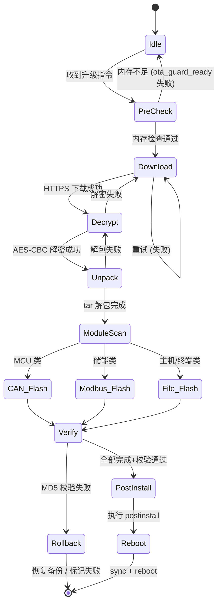

# OTA — 固件远程升级框架设计

> 本文档描述 TBox OTA 子系统的技术架构框架，定义升级全生命周期（下载→验签→解包→烧录→回滚→重启）的标准化流程。
> 框架从实际嵌入式 OTA 工程代码中提炼，剥离业务数据与隐私数据，保留可复用的架构模式。

---

## 1. 总体架构

```
                      Cloud OTA Platform
                            │ (HTTPS / MQTTS)
                            ▼
┌──────────────────────────────────────────────────────────┐
│                    OTA Agent (SoC Linux)                  │
│                                                           │
│  ┌─────────────────────────────────────────────────────┐  │
│  │  ① OTA Engine Layer                                  │  │
│  │  ┌─────────────┐ ┌───────────┐ ┌──────────────────┐ │  │
│  │  │ Download     │ │ Decrypt   │ │ Unpack & Scan    │ │  │
│  │  │ (HTTPS/cURL) │ │ (AES-CBC) │ │ (tar + .info)   │ │  │
│  │  └─────────────┘ └───────────┘ └──────────────────┘ │  │
│  └──────────────────────┬──────────────────────────────┘  │
│                         │                                  │
│  ┌──────────────────────┴──────────────────────────────┐  │
│  │  ② Upgrade Dispatcher                                │  │
│  │  按模块类型分发升级任务到对应的烧录线程                 │  │
│  │  ┌──────────┐ ┌──────────┐ ┌──────────┐            │  │
│  │  │ CAN 通道  │ │ Modbus   │ │ 文件覆盖  │            │  │
│  │  │ (MCU类)  │ │ (储能类)  │ │ (主机类)  │            │  │
│  │  └──────────┘ └──────────┘ └──────────┘            │  │
│  └──────────────────────┬──────────────────────────────┘  │
│                         │                                  │
│  ┌──────────────────────┴──────────────────────────────┐  │
│  │  ③ Lifecycle & Safety Layer                          │  │
│  │  ┌────────────┐ ┌──────────┐ ┌────────────────────┐  │  │
│  │  │ Memory     │ │ MD5      │ │ Rollback &         │  │  │
│  │  │ Guard      │ │ Verify   │ │ Recovery           │  │  │
│  │  └────────────┘ └──────────┘ └────────────────────┘  │  │
│  └──────────────────────────────────────────────────────┘  │
│                                                           │
│  ┌─────────────────────────────────────────────────────┐  │
│  │  ④ IPC Layer (与 Main 进程通信)                      │  │
│  │  ZeroMQ / Station Link / 共享内存                    │  │
│  └─────────────────────────────────────────────────────┘  │
└──────────────────────────────────────────────────────────┘
          │              │              │
          ▼              ▼              ▼
     ┌────────┐  ┌──────────┐  ┌──────────────┐
     │ CAN Bus│  │ Modbus   │  │ 本地文件系统   │
     │ (MCU)  │  │ (储能)   │  │ (eMMC/NAND)  │
     └────────┘  └──────────┘  └──────────────┘
```

---

## 2. 核心框架组件

### 2.1 命名线程池 (Named ThreadPool)

> **来源**：`src/common/thread_pool.*` + `thread_manager.*`

框架提供**按名称注册、按名称启停**的线程池，每个线程持有一个 `atomic_bool stop_flag` 供业务循环检测退出。

```
┌──────────────────────────────────────────────┐
│               ThreadManager                   │
│  ┌──────────────────────────────────────────┐ │
│  │  ThreadPool                              │ │
│  │  ┌──────────────────────────────────────┐│ │
│  │  │  Task[0] = { name:"Can-Receiver",    ││ │
│  │  │              fn: CanReceiverThread,  ││ │
│  │  │              stop_flag, started }    ││ │
│  │  ├──────────────────────────────────────┤│ │
│  │  │  Task[1] = { name:"Download-Thread", ││ │
│  │  │              fn: DownloadThread,     ││ │
│  │  │              stop_flag, started }    ││ │
│  │  ├──────────────────────────────────────┤│ │
│  │  │  Task[2] = { name:"Hmcu-Upgrade",   ││ │
│  │  │              fn: HmcuUpgradeThread,  ││ │
│  │  │              stop_flag, started }    ││ │
│  │  └──────────────────────────────────────┘│ │
│  └──────────────────────────────────────────┘ │
│                                               │
│  WorkerHook(tm, HmcuHook)   ← 子系统注册      │
│  WorkerStartTask(tm, "..")  ← 按名启动        │
│  WorkerStopTask(tm, "..")   ← 按名停止        │
│  WorkerGetTaskStopFlag()    ← 获取退出标志     │
└──────────────────────────────────────────────┘
```

**关键接口**：

| 接口　　　　　　　　　　　　　　　　　　　　 | 说明　　　　　　　　　　　　　　　　　　|
| ----------------------------------------------| -----------------------------------------|
| `thread_pool_init(pool, capacity)`　　　　　 | 初始化线程池，分配 task 数组　　　　　　|
| `thread_pool_add_task(pool, fn, arg, name)`　| 注册任务（不启动），返回 task_id　　　　|
| `thread_pool_start_task_by_name(pool, name)` | 按名称启动线程　　　　　　　　　　　　　|
| `thread_pool_stop_task_by_name(pool, name)`　| 设置 stop_flag，线程自行退出　　　　　　|
| `thread_pool_join_task_by_name(pool, name)`　| 等待线程退出　　　　　　　　　　　　　　|
| `WorkerHook(tm, hook_fn)`　　　　　　　　　　| 子系统注册回调，在回调内填充 ThreadList |
| `WorkerStartTask(tm, "ThreadName")`　　　　　| 按名称启动单个线程　　　　　　　　　　　|

**Hook 模式**——每个子系统通过 Hook 回调注册自己的线程列表：

```c
// 子系统实现
int HmcuHook(ThreadManager* tm) {
    ThreadList *list = malloc(sizeof(ThreadList) * 2);
    list[0] = (ThreadList){ .name = "Can-Receiver",  .fn = CanReceiverThread,  .arg = tm };
    list[1] = (ThreadList){ .name = "Hmcu-Upgrade",  .fn = HmcuUpgradeThread, .arg = tm };
    tm->listCount = 2;
    tm->list = list;
    return 0;
}

// main.c 中注册
WorkerHook(&tm, HmcuHook);
WorkerStartTask(&tm, "Can-Receiver");    // 只启动 CAN 接收线程
```

**设计要点**：
- 线程启动分离：先注册所有任务，再按需逐一启动（依赖就绪顺序）
- 每个任务独立 `stop_flag`，支持精确控制单个线程生命周期
- `Hook` 模式允许各子系统独立开发，main.c 仅做组装

---

### 2.2 Qt 风格定时器 (POSIX Timer)

> **来源**：`src/utils/qtimer.*`

纯 POSIX 实现的 Qt 风格定时器，底层基于 `pthread` + `pthread_cond_timedwait` + `CLOCK_MONOTONIC`。

```
┌──────────────────────────────────────────┐
│               qtimer_t                    │
│  pthread_cond_timedwait(CLOCK_MONOTONIC)  │
│  ┌─────────────┐  ┌────────────────────┐  │
│  │ interval_ms  │  │  timeout_cb()      │  │
│  │ deadline_ms  │  │  -> user_data      │  │
│  │ single_shot  │  │                    │  │
│  │ active       │  │  业务回调           │  │
│  └─────────────┘  └────────────────────┘  │
└──────────────────────────────────────────┘
```

**使用模式**：

```c
static qtimer_t heartBeat;

static void OnHeartBeat(void *user_data) {
    ptcontext ptc = (ptcontext)user_data;
    SendHeartBeat(ptc);                      // 业务回调
}

int InitTimer(void *ctx) {
    qtimer_init(&heartBeat, OnHeartBeat, ctx);
    qtimer_set_interval(&heartBeat, 1000);    // 1 秒周期
    qtimer_set_single_shot(&heartBeat, 0);     // 周期模式
    qtimer_start_default(&heartBeat);
    return 0;
}
```

**关键接口**：

| 接口　　　　　　　　　　　　　　　　 | 说明　　　　　　　　　　　　 |
| --------------------------------------| ------------------------------|
| `qtimer_init(timer, cb, user_data)`　| 初始化 + 创建工作线程　　　　|
| `qtimer_set_interval(timer, ms)`　　 | 设置周期（运行中修改会重计） |
| `qtimer_set_single_shot(timer, 1/0)` | 设置单次/周期模式　　　　　　|
| `qtimer_start_default(timer)`　　　　| 按当前 interval 启动　　　　 |
| `qtimer_start(timer, ms)`　　　　　　| 启动并指定 interval　　　　　|
| `qtimer_stop(timer)`　　　　　　　　 | 停止定时器　　　　　　　　　 |
| `qtimer_destroy(timer)`　　　　　　　| 销毁（停止线程并等待退出）　 |
| `qtimer_single_shot(ms, cb, data)`　 | 静态单次定时器，自动清理　　 |

**设计要点**：
- 基于 `CLOCK_MONOTONIC`，不受系统时间调整（NTP/手动）影响
- 周期模式采用「当前时刻 + interval」算法，回调执行时间不影响下一次触发
- 运行中修改 interval 立即生效，重新从当前时刻计时
- 公开结构体而非不透明句柄，避免堆分配，业务侧直接 `qtimer_t t; qtimer_init(&t, ...)`

---

### 2.3 线程安全消息队列 (环形缓冲区)

> **来源**：`src/common/message_queue.*`

固定容量、定长槽位的线程安全环形队列，用于解耦生产者/消费者。

```
                   ┌─────────────────────────────────────┐
  mq_try_push() → │  head → [slot][slot][slot]... ← tail │ → mq_try_pop()
                   └─────────────────────────────────────┘
                   mutex + not_empty + not_full
```

**关键接口**：

| 接口　　　　　　　　　　　　　　　　| 说明　　　　　　　　　　　　　 |
| -------------------------------------| --------------------------------|
| `mq_create(capacity, msg_size)`　　 | 创建固定容量、固定槽大小的队列 |
| `mq_destroy(q)`　　　　　　　　　　 | 销毁，释放所有资源　　　　　　 |
| `mq_try_push(q, data, len)`　　　　 | 非阻塞入队，满时返回 -1　　　　|
| `mq_try_pop(q, out, cap, &out_len)` | 非阻塞出队，空时返回 0　　　　 |

**设计要点**：
- 纯非阻塞接口，适合中断/定时器上下文使用
- `msg_size` 上限截断（超过则截断而非溢出）
- 条件变量 `not_empty` / `not_full` 支持扩展为阻塞版本

---

### 2.4 内存安全门 (OOM Guard)

> **来源**：`src/utils/ota_guard.*`

启动时预占物理内存，OTA 前释放并检查可用内存，防止升级过程中 OOM。

```
┌──────────────────────────────────────────────┐
│  启动时：ota_guard_init()                     │
│  ┌──────────────────────────────────────────┐ │
│  │ mmap(16MB) + 逐页写入 + mlock             │ │
│  │ → 预占物理内存，防止被换出                 │ │
│  └──────────────────────────────────────────┘ │
│                                              │
│  OTA 触发时：ota_guard_ready(&avail)           │
│  ┌──────────────────────────────────────────┐ │
│  │ 1. munlock + munmap (释放 16MB)          │ │
│  │ 2. 读取 /proc/meminfo MemAvailable       │ │
│  │ 3. 检查 avail ≥ 16MB                     │ │
│  │ 4. return true/false                     │ │
│  └──────────────────────────────────────────┘ │
└──────────────────────────────────────────────┘
```

**阈值**：编译期宏 `OTA_GUARD_THRESHOLD_BYTES`（默认 16MB）

---

### 2.5 IPC 通信帧 (进程间状态同步)

> **来源**：`src/common/inner_comm.*` + `runloop.c`

OTA 进程与 Main 进程之间通过命名 IPC 通道（基于 Station Link/ZMQ）定时同步状态。

```
┌──────────────┐          IPC           ┌──────────────┐
│  OTA Agent   │ ◄────────────────────► │  Main Process │
│  (升级进程)   │    /tmp/InterOTA2Main  │  (业务进程)   │
│              │    /tmp/InterMain2OTA  │              │
└──────────────┘                        └──────────────┘
```

**IPC 帧格式**：

```
┌──────┬──────┬──────┬──────┬────────────────┐
│ ID   │ CRC  │ Len  │ Cnt  │     Payload     │
│ 4B   │ 4B   │ 2B   │ 2B   │   Variable      │
└──────┴──────┴──────┴──────┴────────────────┘
  ┌────────────┬────────────┬──────────────────────┐
  │  Cmd ID    │  Fields    │   Description         │
  ├────────────┼────────────┼──────────────────────┤
  │ CMD_STATUS │ Version    │ 软件版本号            │
  │            │ IMEI/IMSI  │ 设备标识             │
  │            │ Signal     │ 4G 信号质量           │
  │            │ OtaSta     │ OTA 状态              │
  └────────────┴────────────┴──────────────────────┘
```

**同步机制**：100ms 周期定时器驱动 `InterComShot()` → 填充帧 → `InnerComSend()` → IPC 通道

---

## 3. OTA 生命周期状态机

```
                 ┌──────────────┐
                 │    Idle      │
                 └──────┬───────┘
                        │ 收到升级指令 (远程/本地)
                        ▼
                 ┌──────────────┐
                 │  Pre-Check   │ ← ota_guard_ready() 内存检查
                 └──────┬───────┘
                        │ 通过
                        ▼
                 ┌──────────────┐
                 │  Download    │ ← HTTPS 下载加密包
                 └──────┬───────┘
                        │ 成功
                        ▼
                 ┌──────────────┐
                 │  Decrypt     │ ← AES-CBC 解密
                 └──────┬───────┘
                        │ 成功
                        ▼
                 ┌──────────────┐
                 │  Unpack      │ ← tar 解包到临时目录
                 └──────┬───────┘
                        │ 成功
                        ▼
                 ┌──────────────────┐
                 │  Module Scan     │ ← 扫描 .info 文件确定升级模块
                 └──────┬───────────┘
                        │
         ┌──────────────┼──────────────────┐
         ▼              ▼                  ▼
   ┌──────────┐  ┌──────────┐  ┌──────────────────┐
   │ CAN 烧录  │  │ Modbus   │  │ 文件覆盖烧录      │
   │ (MCU类)  │  │ (储能类)  │  │ (主机/终端类)     │
   └────┬─────┘  └────┬─────┘  └──────┬───────────┘
        │              │               │
        └──────────────┼───────────────┘
                       │ 全部完成
                       ▼
                 ┌──────────────┐
                 │  Verify      │ ← MD5 校验 / 回滚判断
                 └──────┬───────┘
                        │ 通过
                        ▼
                 ┌──────────────┐
                 │  Post-       │ ← 执行 postinstall 脚本
                 │  Install     │
                 └──────┬───────┘
                        │
                        ▼
                 ┌──────────────┐
                 │  Reboot      │ ← sync + reboot
                 └──────────────┘

        回滚路径：
        Verify 失败 ──→ Rollback ──→ 恢复备份文件 ──→ 标记失败
```



        回滚路径：
        Verify 失败 ──→ Rollback ──→ 恢复备份文件 ──→ 标记失败
```

---

## 4. OTA 升级流水线设计

### 4.1 HTTPS 下载引擎

```
┌──────────────────────────────────────────────────────────────┐
│  DownloadThread (按名称注册到 ThreadPool)                     │
│                                                               │
│  ① DNS 刷新（RouterDnsFlush）                                 │
│  ② 可用内存检查（ota_guard_ready）                            │
│  ③ https_download_file(req)  ← cURL + OpenSSL (HSM)         │
│  ④ 下载成功 → 更新状态到 IPC 帧                               │
│  ⑤ base64_decode(key) + base64_decode(iv)                    │
│  ⑥ decrypt_file(encrypted, output, key, iv)  ← AES-CBC      │
│  ⑦ CheckUpgradePackage() → 解包 + 扫描模块                   │
│  ⑧ 启动各模块升级线程                                        │
└──────────────────────────────────────────────────────────────┘
```

### 4.2 模块扫描机制

升级包解压后目录结构：

```
/tmp/upgrade/
├── Htcu.info          ← 内容: 二进制文件名 (如 "app_v2.bin")
├── Hmcu.info          ← 内容: 固件文件名
├── Acu.info
├── upgrade.tar        ← 子模块打包 (终端类)
│   └── upgrade/
│       ├── Ttcu.info
│       ├── Tmcu.info
│       └── Tscreen.info
└── (各模块固件二进制)
```

扫描逻辑：
1. 遍历预定义的模块类型列表（`MOD_TTCU` ~ `MOD_SCREEN`）
2. 检查对应的 `.info` 文件是否存在
3. 若存在，读取内容获得固件文件名
4. 检查固件文件是否存在 → 标记 `g_needUpgrade[i] = 1`
5. 汇总需要升级的模块列表，启动对应烧录线程

### 4.3 多通道烧录引擎

| 通道 | 适用模块 | 通信协议 | 升级方式 |
|------|---------|---------|---------|
| **CAN** | MCU, ACU, PDU, DC, AC, SoftStart, DCOBC | CAN UDS (ISO 14229) | 逐帧发送固件数据 |
| **Modbus** | EMCU, BASU, CBMS, AIR, EPTC, EACCD | Modbus RTU | 寄存器写入 + 校验 |
| **文件覆盖 (本地)** | HTCU (主控制器) | cp + MD5 + chmod | 备份 → 复制 → MD5校验 → 回滚 |
| **文件覆盖 (终端)** | TTCU, TMCU, Screen | Ethernet TCP | tar 解包 → 信息扫描 → 以太网发送 |

### 4.4 文件覆盖升级流程（主机类）

```
┌──────────────────────────────────────────────────────────────┐
│  HTCU_Update()                                                │
│                                                               │
│  ① 读取 Htcu.info → 获取所有待更新文件列表                     │
│  ② 创建 /tmp/backup/ 备份目录                                 │
│  ③ 对每个文件:                                                │
│     a. 备份 /opt/xxx → /tmp/backup/xxx                        │
│     b. cp /opt/upgrade/xxx → /opt/xxx                          │
│     c. chmod 777                                               │
│     d. MD5 校验（GetFileMD5）                                 │
│     e. MD5 一致 → 删除源文件，继续                             │
│     f. MD5 不一致 → error_flag = 1，跳出                       │
│  ④ 如果 error_flag == 1:                                      │
│     → mv /tmp/backup/* /opt/ （全量回滚）                      │
│     → 标记 UPGRADE_FAULT                                       │
│  ⑤ 如果全部成功:                                              │
│     → ExecInstallScript()                                     │
│     → sleep(15) + sync + reboot                               │
└──────────────────────────────────────────────────────────────┘
```

### 4.5 CAN 总线升级流程（MCU 类）

OTA Agent **不直接实现 CAN UDS 协议栈**，而是通过 UDS Server 的 CAN 路由能力完成 MCU 烧录。

```
┌──────────────────────────────────────────────────────────────┐
│  OTA Agent → UDS Server → CAN 烧录                            │
│                                                               │
│  ① OTA Agent 读取 .info 文件 → 获取固件文件名                  │
│  ② OTA Agent 打开固件文件 → 分块读取（每块 ≤ 4KB）            │
│  ③ 对每一块：                                                 │
│     a. OTA Agent 通过 IPC 调用 UDS Server 的                    │
│        0x34 RequestDownload → 0x36 TransferData               │
│     b. UDS Server 负责 CAN 帧拆包 (ISO 15765-2 多帧)           │
│     c. UDS Server 通过 SPI-CAN Gateway → MCU → CAN Bus       │
│     d. 接收 0x36 应答 → 反馈 OTA Agent                        │
│  ④ 全部块传输完毕：                                           │
│     a. OTA Agent 调用 UDS Server: 0x37 RequestTransferExit   │
│     b. UDS Server → ECU 退出编程会话                           │
│     c. OTA Agent 更新升级进度                                  │
│                                                               │
│  UDS Server 职责：CAN 帧封包/解包、UDS 应答处理、超时重传      │
│  OTA Agent 职责：固件文件管理、分块策略、整体进度跟踪           │
└──────────────────────────────────────────────────────────────┘
```

**依赖**：`can.bus`（经 UDS Server → SPI-CAN Gateway → MCU）

> **设计原则**：OTA Agent 作为升级业务的**编排者**，不持有 CAN 协议栈实现。
> UDS 协议细节（0x10 会话控制、0x27 安全访问、0x34/36/37 传输）封装在 UDS Server 中（见 `UDS.md §3.2`）。
> 两者通过 IPC（ZMQ REQ/REP → `ipc:///tmp/tbox_cgw_req.ipc`）通信。

---

## 5. 心跳与登录状态机

> **来源**：`src/common/runloop.c` — LoginHeartBeatLoop

```
┌──────────────────────────────────────────────────────────────┐
│  定时器: LoginHeartBeatShot (1 秒周期)                        │
│                                                               │
│  if (首次) → 发送登录报文，interval 改为 5 秒                  │
│                                                               │
│  if (未登录):                                                  │
│     if (loginNum >= 3):                                       │
│       重新发送登录报文                                        │
│       重置 loginNum                                           │
│     else:                                                     │
│       loginNum++                                              │
│                                                               │
│  if (已登录):                                                  │
│     发送心跳报文                                               │
│     检测心跳应答是否超时：                                     │
│       if (RecvHeartCmdCnt 连续 checkCount 次未变化):           │
│         打印"心跳应答超时"警告                                  │
│       if (恢复变化):                                           │
│         打印"心跳应答恢复"                                      │
└──────────────────────────────────────────────────────────────┘
```

---

## 6. 升级超时与异常处理

| 场景 | 处理方式 |
|------|---------|
| 下载失败 | 重试（指数退避），标记 `OtaHttpsSta = 2` |
| 解密失败 | 标记 `OtaMainSta = 0x04`（文件解压失败） |
| MD5 校验失败 | 全量回滚（`/tmp/backup/*` → `/opt/*`） |
| MCU 烧录超时 | 累计 `ttcuTimeoutValue`，超 3600s 强制退出 |
| OTA 总超时 | 70 分钟无进展 → `OTA70MinsTimeoutExit()` |
| 内存不足 | `ota_guard_ready()` 返回 false，拒绝进入升级 |
| __attribute__((constructor)) | 启动时预分配内存（main 之前执行） |

---


## 7. 依赖链（硬件 → 中间件 → OTA）

```
hardware.md                    middleware.md                  OTA.md
──────────                     ────────────                  ──────
SoC CPU                       → Daemon Monitor              ThreadManager 线程编排
eMMC (系统分区)                → OTA Agent                   升级包落地 / 双分区
eMMC (备份分区)                                              Rollback 备份目录
NAND                          → Log Manager                 升级日志记录
4G / WiFi / Ethernet          → Comm Manager                 HTTPS 下载通道
                              → CloudGW (MQTTS)             升级指令接收
                              → HSM Server                  升级包签名校验
HSM                           → (OpenSSL engine)            解密密钥存储
CAN Bus                       → SPI-CAN Gateway             MCU 模块烧录通道
Modbus RTU                    → (直接 tty)                  储能模块烧录通道
```

---

## 8. 编译配置

| 宏 | 说明 |
|----|------|
| `OTA_NO_MQTT` | 禁用 MQTT 通道，使用 Socket 直连服务器（兼容模式） |
| `OTA_GUARD_THRESHOLD_BYTES` | 内存安全门阈值，默认 16MB |
| `OTA_ENABLE_GDB` | 添加 `-g -O0` 调试符号 |

---

## 9. 修订记录

| 版本 | 日期 | 修改内容 | 修改人 |
|------|------|---------|--------|
| v0.1 | — | 初版 OTA 框架，从嵌入式工程提取通用架构模式 | — |
