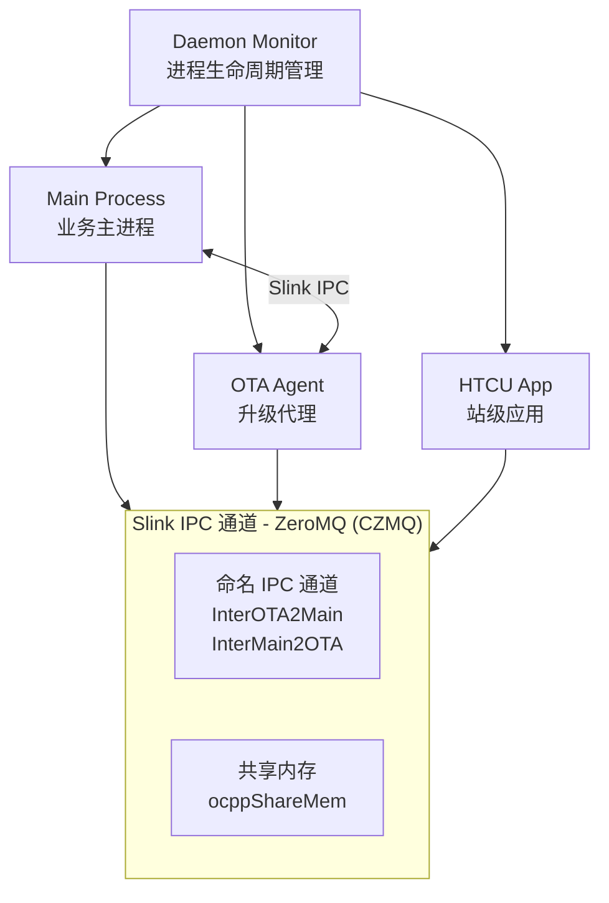

# Slink — 本地进程间通信 (IPC) 框架

> Slink (Station Link) 是 TBox 平台**本地进程间通信框架**，基于 ZeroMQ 实现。
> 与 CloudGW 的区别：Slink **只处理本地 IPC 传输**，不涉及任何云端报文。
> CloudGW 负责 MQTTS 上行/下行，Slink 负责进程间的本地数据交换。

---

## 1. IPC 域划分

```
┌──────────────────────────────────────────────────────────────────┐
│                    TBox 进程间通信平面                              │
│                                                                   │
│  ┌──────────────────────────────────────────────────────────┐    │
│  │  域 A：CloudGW 通道 (ZMQ) — 云端数据交换                    │    │
│  │                                                            │    │
│  │  ipc:///tmp/tbox_cgw_pub.ipc  ← CloudGW PUB (云端→本地)   │    │
│  │  ipc:///tmp/tbox_cgw_sub.ipc  → CloudGW SUB (本地→云端)   │    │
│  │  ipc:///tmp/tbox_cgw_rep.ipc  ← CloudGW REP (RPC 处理)   │    │
│  │  ipc:///tmp/tbox_cgw_req.ipc  → CloudGW REQ (发起 RPC)   │    │
│  │                                                            │    │
│  │  参与进程：HTCU / TTCU / OTA / UDS ...                      │    │
│  └──────────────────────────────────────────────────────────┘    │
│                                                                   │
│  ┌──────────────────────────────────────────────────────────┐    │
│  │  域 B：Slink 通道 (ZMQ) — 本地进程间数据交换                │    │
│  │                                                            │    │
│  │  /tmp/InterOTA2Main  ← OTA Agent → Main Process            │    │
│  │  /tmp/InterMain2OTA  ← Main Process → OTA Agent            │    │
│  │  + 扩展命名通道 (按需)                                       │    │
│  │                                                            │    │
│  │  参与进程：Main / OTA Agent / 中间件服务 / ...                │    │
│  └──────────────────────────────────────────────────────────┘    │
│                                                                   │
│  ┌──────────────────────────────────────────────────────────┐    │
│  │  域 C：共享内存 — 高频/低延迟数据交换                       │    │
│  │                                                            │    │
│  │  OCPP 共享内存 (ocppShareMem) ← Main ↔ OTA Agent           │    │
│  │  系统运行时状态 (电量/电压/电流/温度)                        │    │
│  └──────────────────────────────────────────────────────────┘    │
└──────────────────────────────────────────────────────────────────┘
```

---

## 2. Slink 总框图

```
                    ┌─────────────────────────────────────┐
                    │          Daemon Monitor             │
                    │   (进程生命周期管理)                  │
                    └──────────────┬──────────────────────┘
                                   │ 启动 / 停止 / 监控
                                   │
     ┌─────────────────────────────┼─────────────────────────────┐
     │                             │                             │
     ▼                             ▼                             ▼
┌──────────────┐          ┌──────────────────┐          ┌──────────────┐
│  Main Process │          │   OTA Agent       │          │  HTCU App    │
│  (业务主进程)  │◄────────┤   (升级代理)      │          │  (站级应用)   │
│              │  Slink   │                  │          │              │
│  ocpp 状态    │  IPC     │  升级状态        │          │  充电控制      │
│  路由管理     │          │  下载进度        │          │  功率调度      │
│  登录心跳     │          │  烧录状态        │          │              │
└──────────────┘          └──────────────────┘          └──────────────┘
       │                        │                             │
       │    ┌───────────────────┼─────────────────────────────┘
       │    │                   │
       ▼    ▼                   ▼
┌──────────────────────────────────────────────────────────────────┐
│                      Slink IPC 通道                               │
│                                                                   │
│  底层：ZeroMQ (CZMQ) — station_link 封装                          │
│                                                                   │
│  ┌──────────────────────┐  ┌────────────────────────────────┐    │
│  │ 命名 IPC 通道          │  │ 共享内存                       │    │
│  │                       │  │                                │    │
│  │ InterOTA2Main        │  │ ocppShareMem                   │    │
│  │ InterMain2OTA        │  │ (OCPP 状态 / 充电数据)          │    │
│  │ (按需扩展更多通道)     │  │                                │    │
│  └──────────────────────┘  └────────────────────────────────┘    │
└──────────────────────────────────────────────────────────────────┘
```



---

## 3. IPC 帧格式

Slink 使用定长帧 + 变长载荷的协议格式：

```
┌──────┬──────┬──────┬──────┬────────┬────────────────┐
│ ID   │ CRC  │ Len  │ Cnt  │ Cmd    │ Payload         │
│ 4B   │ 4B   │ 2B   │ 2B   │ 4B     │ Variable (≤4KB) │
└──────┴──────┴──────┴──────┴────────┴────────────────┘
```

| 字段 | 说明 |
|------|------|
| `ID` | 帧标识 (固定 UID 0x12345678) |
| `CRC` | 载荷校验 |
| `Len` | 帧总长度 |
| `Cnt` | 递增序列号，防重放/乱序 |
| `Cmd` | 命令标识 (如 `CMD_0001_GEN=0x1`) |
| `Payload` | 载荷数据 (包含版本/IMEI/信号/OTA 状态等) |

**同步机制**：100ms 周期定时器驱动 `InterComShot()` → 填充帧 → `InnerComSend()` → Slink IPC

---

## 4. 典型数据流

```
                      ┌────────────────────────────┐
                      │     100ms 周期定时器         │
                      │     (runloop.c)            │
                      └────────────┬───────────────┘
                                   │
                                   ▼
                    ┌──────────────────────────────┐
                    │  填充 InterComFrame 数据       │
                    │  (版本/IMEI/IMSI/信号/OTA 状态) │
                    └────────────┬─────────────────┘
                                 │ InnerComSend()
                                 ▼
                    ┌──────────────────────────────┐
                    │  Slink IPC 通道               │
                    │  (ZeroMQ → station_link)      │
                    └────────────┬─────────────────┘
                                 │
                                 ▼
                    ┌──────────────────────────────┐
                    │  Main Process                 │
                    │  (收到状态帧，更新运行时数据)    │
                    └──────────────────────────────┘
```

---

## 5. 与 CloudGW 的职责边界

| 维度 | **Slink (本地 IPC)** | **CloudGW (云端网关)** |
|------|---------------------|----------------------|
| **通信方向** | 进程↔进程（本地） | 本地↔云端（远程） |
| **底层协议** | ZeroMQ (IPC 模式) | MQTTS + ZeroMQ (本地) |
| **通道标识** | `/tmp/Inter*` 命名通道 | `ipc:///tmp/tbox_cgw_*.ipc` |
| **数据类型** | 本地状态帧 / OTA 进度 | 云上下行报文 / Topic 路由 |
| **参与进程** | Main / OTA Agent | HTCU / TTCU / UDS / 等 |
| **业务载荷** | 系统状态、升级状态、心跳 | 充电数据、交易记录、远程指令 |
| **周期性** | 100ms 周期推送 | 事件驱动 + 1s 心跳 |

---

## 6. 修订记录

| 版本 | 日期 | 修改内容 | 修改人 |
|------|------|---------|--------|
| v0.1 | — | 初版 Slink 本地 IPC 框图 | — |
