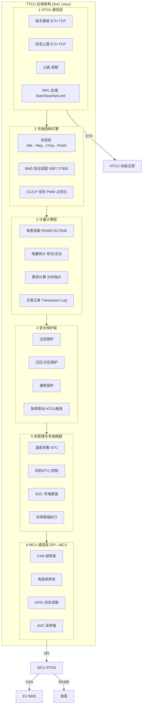

# TTCU — 充电桩终端应用设计

> TTCU (Terminal TCU) 是充电**桩级终端应用**，运行于 SoC Linux + MCU 双处理器平台。
> 它接收 HTCU 的调度指令，直接控制充电枪与 EV 的充放电过程，执行计量计费与安全保护。
> **角色定位**：桩级执行层，不参与站级功率分配和储能调度，专注单桩充放电控制。

---

## 1. 系统角色定位

```
┌──────────────────────────────────────────────────────────────────┐
│                      HTCU (站级主控)                               │
│  功率分配 / 储能调度 / 云平台通信 / 站级安全保护                     │
└──────────────────────┬───────────────────────────────────────────┘
                       │ Ethernet TCP (HTCU↔TTCU 协议)
                       ▼
┌──────────────────────────────────────────────────────────────────┐
│                      TTCU (桩级终端)                               │
│                                                                │
│  职责范围：单桩充放电控制、BMS 通信、计量计费、安全保护           │
│  运行平台：SoC Linux（应用层）+ MCU（实时控制层）                 │
│  通信对象：HTCU / EV BMS / 电表 / 充电枪 / 用户 HMI             │
│                                                                │
│  ┌──────────────┐  ┌──────────────┐  ┌──────────────────────┐  │
│  │  充放电控制    │  │  计量计费    │  │  安全保护              │  │
│  ├──────────────┤  ├──────────────┤  ├──────────────────────┤  │
│  │  热管理       │  │  充电限额    │  │  电量统计              │  │
│  │              │  │              │  │                       │  │
│  └──────┬───────┘  └──────┬───────┘  └──────────┬───────────┘  │
│         │                 │                      │              │
│  ┌──────┴─────────────────┴──────────────────────┴───────────┐  │
│  │              MCU 实时层（RTOS/Baremetal）                   │  │
│  │  ┌──────────┐ ┌──────────┐ ┌──────────┐ ┌──────────────┐ │  │
│  │  │ CAN BMS  │ │ RS485    │ │ GPIO     │ │ ADC/PWM      │ │  │
│  │  │ 通信      │ │ 电表通信  │ │ 接触器   │ │ 温度/风扇    │ │  │
│  │  └──────────┘ └──────────┘ └──────────┘ └──────────────┘ │  │
│  └──────────────────────────────────────────────────────────┘  │
└──────────────────────────────────────────────────────────────────┘
              │               │               │
              ▼               ▼               ▼
          EV Battery      电表 (DL/T645)   充电枪 (CC/CP)
```

---

## 2. 总体架构

```
┌──────────────────────────────────────────────────────────────────┐
│                     TTCU 应用架构（SoC Linux 侧）                    │
│                                                                   │
│  ┌──────────────────────────────────────────────────────────────┐ │
│  │  ① HTCU 通信层                                                 │ │
│  │  ┌──────────┐ ┌──────────┐ ┌──────────┐ ┌──────────────────┐│ │
│  │  │ 指令接收  │ │ 状态上报  │ │ 心跳     │ │ RPC 处理         ││ │
│  │  │ (ETH TCP)│ │ (ETH TCP)│ │ (周期)   │ │ (Start/Stop/    ││ │
│  │  │          │ │          │ │          │ │  SetLimit)       ││ │
│  │  └──────────┘ └──────────┘ └──────────┘ └──────────────────┘│ │
│  └──────────────────────────┬───────────────────────────────────┘ │
│                             ▼                                     │
│  ┌──────────────────────────────────────────────────────────────┐ │
│  │  ② 充电控制引擎 (Charging Engine)                              │ │
│  │  ┌──────────────────┐ ┌──────────────────┐ ┌────────────────┐ │ │
│  │  │ 状态机管理        │ │ BMS 协议适配     │ │ CC/CP 信号     │ │ │
│  │  │ (Idle→Neg→Chrg→  │ │ (GB/T 27930 /   │ │ 检测与模拟     │ │ │
│  │  │  Wait→Finish)    │ │  CHAdeMO / CCS) │ │ (PWM 占空比)   │ │ │
│  │  └──────────────────┘ └──────────────────┘ └────────────────┘ │ │
│  └──────────────────────────┬───────────────────────────────────┘ │
│                             ▼                                     │
│  ┌──────────────────────────────────────────────────────────────┐ │
│  │  ③ 计量计费层 (Metering & Billing)                             │ │
│  │  ┌──────────┐ ┌──────────┐ ┌──────────┐ ┌──────────────────┐│ │
│  │  │ 电表读取  │ │ 电量统计  │ │ 费率计算  │ │ 交易记录         ││ │
│  │  │ RS485    │ │ 有功/    │ │ 分时电价  │ │ (Transaction Log)││ │
│  │  │ DL/T645  │ │ 无功     │ │          │ │                  ││ │
│  │  └──────────┘ └──────────┘ └──────────┘ └──────────────────┘│ │
│  └──────────────────────────┬───────────────────────────────────┘ │
│                             ▼                                     │
│  ┌──────────────────────────────────────────────────────────────┐ │
│  │  ④ 安全保护层 (Safety Layer)                                   │ │
│  │  ┌──────────┐ ┌──────────┐ ┌──────────┐ ┌──────────────────┐│ │
│  │  │ 过流保护  │ │ 过压/    │ │ 漏电保护  │ │ 急停联动         ││ │
│  │  │          │ │ 欠压保护  │ │          │ │ (HTCU 触发)      ││ │
│  │  └──────────┘ └──────────┘ └──────────┘ └──────────────────┘│ │
│  └──────────────────────────┬───────────────────────────────────┘ │
│                             ▼                                     │
│  ┌──────────────────────────────────────────────────────────────┐ │
│  │  ⑤ 热管理与充电限额                                            │ │
│  │  ┌──────────┐ ┌──────────┐ ┌──────────┐ ┌──────────────────┐│ │
│  │  │ 温度采集  │ │ 风机/PTC │ │ SOC      │ │ 功率限值执行     ││ │
│  │  │ (NTC)    │ │ 控制     │ │ 充电限值  │ │ (来自 HTCU)      ││ │
│  │  └──────────┘ └──────────┘ └──────────┘ └──────────────────┘│ │
│  └──────────────────────────────────────────────────────────────┘ │
│                                                                   │
│  ┌──────────────────────────────────────────────────────────────┐ │
│  │  ⑥ MCU 通信层 (SPI ↔ MCU)                                     │ │
│  │  ┌──────────┐ ┌──────────┐ ┌──────────┐ ┌──────────────────┐│ │
│  │  │ CAN 帧   │ │ 电表帧   │ │ GPIO     │ │ ADC 采样值       ││ │
│  │  │ 转发     │ │ 转发     │ │ 状态读取  │ │ (温度/电压)       ││ │
│  │  └──────────┘ └──────────┘ └──────────┘ └──────────────────┘│ │
│  └──────────────────────────────────────────────────────────────┘ │
│                                                                   │
└──────────────────────────────────────────────────────────────────┘
```



### 3.1 充放电管理

TTCU 最核心的功能——充电过程全生命周期控制。

**充电状态机**：

```
Idle (待机)
  │ 插枪 → CC/CP 检测 → BMS 握手
  ▼
Negotiation (协商)
  │ BMS 发送 CHM/BRM/BCP → 桩响应 CTS/CML/BRO → 确认充电参数
  ▼
Charging (充电中)
  │ 闭环调节输出功率
  │ ├── BMS 请求 (BCL) → 桩调节 PWM 占空比 / 输出电压电流
  │ ├── 电表实时计量
  │ ├── 安全保护监控 (过流/过温/漏电)
  │ └── 心跳保活 (BMS↔桩, 5秒超时检测)
  │
  ├── BMS 发送 CST 停止 → 正常结束
  ├── HTCU 下发 StopCharging → 强制停止
  ├── 安全保护触发 → 紧急停止
  └── 拔枪检测 (CC 信号断开) → 结束
      │
      ▼
Completed (完成)
  │ 生成交易记录 → 上报 HTCU
  ▼
Idle
```

**依赖**：`can.bus`（BMS 通信）、`gpio`（CC/CP 检测）、`adc`（CP 电压采样）

### 3.2 安全保护功能

```
┌──────────────────────────────────────────────────────────────────┐
│  PileSafetyManager                                               │
│                                                                   │
│  ┌────────────────┐  ┌────────────────┐  ┌────────────────────┐  │
│  │ 过流保护        │  │ 过压/欠压保护   │  │ 漏电保护            │  │
│  │                │  │                │  │                    │  │
│  │ 检测: 电流互感器│  │ 检测: 电压传感器│  │ 检测: 漏电保护器     │  │
│  │ 阈值: 额定1.2倍│  │ 阈值: ±15%     │  │ 阈值: 30mA         │  │
│  │ 动作: 1ms 内   │  │ 动作: 100ms    │  │ 动作: 立即分闸      │  │
│  │ 断开接触器     │  │ 限功率/停机    │  │                    │  │
│  └────────────────┘  └────────────────┘  └────────────────────┘  │
│                                                                   │
│  ┌────────────────┐  ┌────────────────┐  ┌────────────────────┐  │
│  │ 过温保护        │  │ 急停联动       │  │ BMS 通信超时        │  │
│  │                │  │               │  │                    │  │
│  │ 枪头温度 ≥ 90°C│  │ HTCU 下发     │  │ 5秒未收到 BMS 帧    │  │
│  │ 模块温度 ≥ 80°C│  │ EmergencyStop │  │ → 停止输出，告警     │  │
│  │ → 停止充电     │  │ → 立即分闸     │  │                    │  │
│  └────────────────┘  └────────────────┘  └────────────────────┘  │
│                                                                   │
│  所有保护触发动作：                                                │
│  1. 断开充电接触器 (MCU GPIO → 继电器)                            │
│  2. 生成故障记录 (本地存储)                                        │
│  3. 上报告警帧到 HTCU (Ethernet)                                  │
│  4. 更新桩状态为 Fault                                            │
└──────────────────────────────────────────────────────────────────┘
```

**硬件路径**：
- 过流/过压：ADC 采样 → MCU → SPI → SoC → 保护逻辑 → SPI → MCU GPIO → 接触器
- 急停：GPIO 中断 → SoC → 保护逻辑 → SPI → MCU GPIO → 接触器
- 漏电：漏电保护器硬接线直接跳闸（独立于 SoC/MCU）

**依赖**：`adc`、`gpio`、`can.bus`、`serial.spi`

### 3.3 热管理

```
┌──────────────────────────────────────────────┐
│  ThermalManager (桩级)                        │
│                                                │
│  传感器布局：                                   │
│  ├─ 充电模块进风口温度 (NTC)                    │
│  ├─ 充电模块出风口温度 (NTC)                    │
│  ├─ 充电枪头温度 (NTC)                          │
│  └─ 环境温度 (NTC)                              │
│                                                │
│  控制策略：                                     │
│  ┌──────────┬────────────┬──────────────────┐  │
│  │ 温度区间   │ 风机转速    │ 充电功率限制      │  │
│  ├──────────┼────────────┼──────────────────┤  │
│  │ < 40°C   │ 关闭/低速   │ 额定功率           │  │
│  │ 40-65°C  │ PID 调速   │ 额定功率           │  │
│  │ 65-80°C  │ 全速       │ 线性降额 100%→50%│  │
│  │ > 80°C   │ 全速       │ 停止充电          │  │
│  └──────────┴────────────┴──────────────────┘  │
└──────────────────────────────────────────────────┘
```

**依赖**：`adc`（NTC 采样）、`pwm`（风机调速）、`can.bus`（BMS 温度数据）

### 3.4 电量统计

```
┌──────────────────────────────────────────────┐
│  EnergyMetering                                │
│                                                │
│  电表接口：                                     │
│  ├─ 物理层：RS485                               │
│  ├─ 协议层：DL/T 645-2007 或 Modbus RTU         │
│  ├─ 数据项：有功电能 / 无功电能 / 电压 / 电流    │
│  │         功率 / 功率因数 / 频率                │
│  └─ 采集周期：1 秒                               │
│                                                │
│  统计类型：                                     │
│  ├─ 累计充电电量 (kWh)                          │
│  ├─ 累计放电电量 (kWh)  [V2G 场景]              │
│  ├─ 当次充电电量                                 │
│  ├─ 日/月/年 电量统计                            │
│  └─ 峰/谷/平 分时电量                            │
│                                                │
│  上报告警：                                     │
│  ├─ 电表通信中断 → 停止充电并告警                │
│  ├─ 电量异常跳变 → 标记数据异常                   │
│  └─ 电表参数修改 → 记录事件日志                  │
└──────────────────────────────────────────────────┘
```

**依赖**：`serial.rs485`（电表通信）→ `storage.emmc`（统计数据持久化）

### 3.5 计费系统

```
┌──────────────────────────────────────────────┐
│  BillingEngine                                 │
│                                                │
│  费率方案（由 HTCU 下发或本地预置）：             │
│  ├─ 尖段：1.1 元/kWh (10:00-12:00, 17:00-19:00)│
│  ├─ 峰段：0.8 元/kWh                           │
│  ├─ 平段：0.5 元/kWh                           │
│  └─ 谷段：0.2 元/kWh                           │
│                                                │
│  计费流程：                                     │
│  ① 充电开始 → 记录起始电量 + 时间戳              │
│  ② 充电中 → 实时累计 (电量 × 当前费率)           │
│  ③ 充电结束 → 计算总金额                        │
│  ④ 生成交易记录 → 上报 HTCU → 云平台             │
│                                                │
│  交易记录格式：                                  │
│  ┌──────────┬────────┬────────┬────────────────┐│
│  │ 桩编号    │ 启动时间 │ 结束时间 │ 充电电量(kWh) ││
│  ├──────────┼────────┼────────┼────────────────┤│
│  │ 电费(元)  │ 服务费  │ 总金额  │ 支付方式       ││
│  └──────────┴────────┴────────┴────────────────┘│
│                                                │
│  本地存储：                                      │
│  ├─ 最近 1000 条交易记录 (eMMC, SQLite)          │
│  └─ 未上传记录断网缓存 → 恢复后补传              │
└──────────────────────────────────────────────────┘
```

**依赖**：`storage.emmc`（交易记录）、`time.rtc`（时间戳）、`net.eth`（上报 HTCU）

### 3.6 充电限额

```
┌──────────────────────────────────────────────┐
│  ChargingLimit                                 │
│                                                │
│  限值来源：                                     │
│  ├─ HTCU 下发的动态功率限值（站级功率分配输出）   │
│  ├─ 本桩配置的额定功率上限（硬件限制）            │
│  ├─ SOC 充电限值（BMS 请求）                    │
│  └─ 温度降额限值（热管理策略）                   │
│                                                │
│  执行逻辑：                                     │
│  最终限值 = MIN(                                 │
│      HTCU 下发限值,                              │
│      桩额定功率,                                 │
│      BMS 请求功率,                               │
│      温度降额功率                                │
│   )                                             │
│                                                │
│  输出：PWM 占空比 (CP 信号) 控制充电功率          │
│                                                │
│  更新周期：100ms                                 │
└──────────────────────────────────────────────────┘
```

**依赖**：`pwm`（CP 信号生成）、`can.bus`（BMS 功率请求）

---

## 4. TTCU 双处理器架构

```
┌──────────────────────────────────────────────────────────────────┐
│  TTCU 硬件架构（SoC + MCU 双处理器）                               │
│                                                                   │
│  ┌────────────────────────────────────────────────────────────┐   │
│  │  SoC (Linux) — 应用层                                        │   │
│  │                                                              │   │
│  │  ┌──────────┐ ┌──────────┐ ┌────────────────────────────┐   │   │
│  │  │ HTCU     │ │ 充电控制  │ │ 计量计费                    │   │   │
│  │  │ 通信     │ │ 引擎     │ │ (电表读取 + 计费 + 交易存储) │   │   │
│  │  └────┬─────┘ └────┬─────┘ └──────────────┬─────────────┘   │   │
│  │       │             │                      │                  │   │
│  │  ┌────┴─────────────┴──────────────────────┴──────────────┐  │   │
│  │  │              SPI-CAN Gateway (中间件)                    │  │   │
│  │  │              SPI 通信 / 帧协议解析 / 虚拟 CAN           │  │   │
│  │  └──────────────────────────┬─────────────────────────────┘  │   │
│  └─────────────────────────────┼────────────────────────────────┘   │
│                                │ SPI                                │
│  ┌─────────────────────────────┼────────────────────────────────┐   │
│  │  MCU (RTOS) — 实时控制层     │                                │   │
│  │                             ▼                                │   │
│  │  ┌────────────────────────────────────────────────────────┐  │   │
│  │  │  MCU 固件                                                │  │   │
│  │  │  ┌──────────┐ ┌──────────┐ ┌──────────┐ ┌────────────┐ │  │   │
│  │  │  │ CAN 总线 │ │ RS485    │ │ GPIO     │ │ ADC/PWM    │ │  │   │
│  │  │  │ (BMS)    │ │ (电表)   │ │ (接触器)  │ │ (温度/CP)  │ │  │   │
│  │  │  └──────────┘ └──────────┘ └──────────┘ └────────────┘ │  │   │
│  │  └────────────────────────────────────────────────────────┘  │   │
│  └──────────────────────────────────────────────────────────────┘   │
└──────────────────────────────────────────────────────────────────────┘
```

**职责划分**：

| 层次 | 处理器 | 操作系统 | 职责 |
|------|--------|---------|------|
| 应用层 | SoC | Linux | HTCU 通信、充电控制引擎、计量计费、热管理策略、交易存储 |
| 实时层 | MCU | RTOS / Baremetal | CAN BMS 协议解析、电表 RS485 采集、GPIO 接触器控制、ADC 采样、PWM CP 信号、安全保护硬逻辑 |
| 桥接 | — | SPI | MCU↔SoC 通信，帧协议参见 [hardware.md §2 SPI 行] |

---

## 5. 硬件依赖链

| TTCU 功能 | 硬件能力 ID | 中间件服务 | 内核接口 |
|-----------|------------|-----------|---------|
| HTCU 通信 | `net.eth` | Comm Manager | `eth0` (TCP) |
| CAN BMS 通信 | `can.bus` | **SPI-CAN Gateway** | `/dev/vcan0` |
| RS485 电表 (通过 MCU) | `serial.rs485` | **SPI-CAN Gateway** (MCU 转发) | `/dev/ttyRS*` (MCU 侧) |
| GPIO 控制 (通过 MCU) | `gpio` | **SPI-CAN Gateway** (MCU 转发) | 经 MCU SPI 转发 |
| ADC 采样 (通过 MCU) | `adc` | **SPI-CAN Gateway** (MCU 转发) | 经 MCU SPI 转发 |
| PWM 控制 (通过 MCU) | `pwm` | **SPI-CAN Gateway** (MCU 转发) | 经 MCU SPI 转发 |
| 交易记录存储 | `storage.emmc` | — | `/dev/mmcblk0` (ext4/SQLite) |
| 时间戳 | `time.rtc` | Time Sync | `/dev/rtc0` |
| **OTA 升级** | `net.eth`, `storage.emmc` | **OTA Agent** (调用) | ETH TCP 下载 → 文件覆盖烧录 |

---

## 6. TTCU ↔ MCU SPI 通信帧（示意）

TTCU SoC 侧所有 MCU 外设通信均通过**中间件 SPI-CAN Gateway** 通道转发：

```
TTCU App → SocketCAN (vcan0) → SPI-CAN Gateway → /dev/spidev → MCU

SPI 帧格式（由 SPI-CAN Gateway 封装/解封装）：

┌──────┬──────┬──────┬──────┬──────────┬──────────┐
│ SOF  │ Len  │ Type │ Chn  │ Payload   │ CRC      │
│ 1B   │ 1B   │ 1B   │ 1B   │ Variable  │ 2B       │
└──────┴──────┴──────┴──────┴──────────┴──────────┘

Type:
  0x01 = CAN 帧发送    (SoC→MCU, 经 vcan0 → SPI-CAN GW 转发)
  0x02 = CAN 帧接收    (MCU→SoC, 经 SPI-CAN GW → vcan0)
  0x03 = RS485 电表指令 (SoC→MCU, 经 SPI-CAN GW 转发)
  0x04 = RS485 电表数据  (MCU→SoC, 经 SPI-CAN GW 转发)
  0x05 = GPIO 控制     (SoC→MCU, 接触器合/分)
  0x06 = GPIO 状态     (MCU→SoC, 接触器状态)
  0x07 = ADC 采样值    (MCU→SoC, 温度/电压)
  0x08 = PWM 设置      (SoC→MCU, CP 占空比)
```

---

## 7. OTA 远程升级

TTCU 作为桩级终端，通过 OTA Agent 完成固件升级：

| 升级模块 | 通道 | 方式 | 说明 |
|---------|------|------|------|
| TTCU SoC 应用 | Ethernet TCP | 文件覆盖烧录 | OTA Agent 解密解包 → 以太网发送 → TTCU 备份/替换/重启 |
| TTCU MCU 固件 | CAN (经 UDS Server) | UDS 0x34/0x36/0x37 | 同 MCU 类模块烧录流程，见 `OTA.md §4.5` |

**升级流程**（SoC 应用侧）：
```
OTA Agent 通知 (ETH TCP) → TTCU 接收升级包 → 备份当前版本 → 替换文件
→ MD5 校验 → systemctl restart → 启动新版本 → 上报 HTCU 版本号
```

**依赖**：`net.eth`（OTA 通道）、`storage.emmc`（备份分区）、`OTA Agent`（见 `OTA.md`）

---

## 8. HTCU ↔ TTCU 交互概览

```
HTCU                                     TTCU
  │                                        │
  │── StartCharging (pile_id, power_limit) │
  │                                        ├── CC/CP 检测 → BMS 握手
  │                                        ├── 电表起始读数
  │                                        ├── 闭合接触器
  │                                        │── StartChargingAck (status)
  │                                        │
  │                                        │  [充电中，定时上报]
  │◄── StatusReport (V/I/P/kWh/温度) ──────│    (1 秒周期)
  │                                        │
  │── SetPowerLimit (new_limit) ──────────→│    (功率分配调整)
  │                                        │
  │── StopCharging ───────────────────────→│
  │                                        ├── 断开接触器
  │                                        ├── 电表结束读数
  │                                        ├── 生成交易记录
  │                                        │── TransactionLog (交易数据)
  │                                        │
  │◄── FaultAlarm (故障码) ────────────────│    (异常时主动上报)
```

---

## 9. 修订记录

| 版本 | 日期 | 修改内容 | 修改人 |
|------|------|---------|--------|
| v0.1 | — | 初版 TTCU 桩级终端应用设计 | — |
