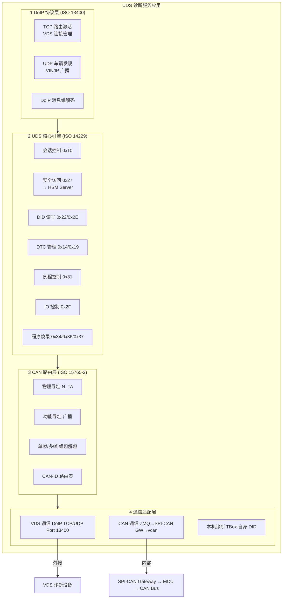

# UDS — 统一诊断服务应用设计

> UDS 诊断服务应用运行于 TBox SoC Linux 用户空间，作为**车载 DoIP 边缘节点**，
> 对外连接 VDS（外接诊断设备），对内通过 CAN 总线访问目标 ECU，
> 提供故障码读取、参数标定、程序烧录等全功能 UDS 诊断服务。

---

## 1. 系统角色定位

```
                    ┌────────────────────────────────────────────┐
                    │  VDS（外接诊断设备）                         │
                    │  PC / 平板诊断工具                          │
                    │  DoIP Client (ISO 13400)                   │
                    └─────────────────┬──────────────────────────┘
                                      │ Ethernet (DoIP)
                                      │ TCP port 13400
                                      ▼
┌──────────────────────────────────────────────────────────────────┐
│                TBox — DoIP Edge Node (UDS Server)                │
│                                                                   │
│  角色：DoIP Gateway + UDS Router                                  │
│  职责：VDS 接入鉴权 / DoIP↔CAN 协议转换 / 多 ECU 路由 /          │
│         安全访问控制 / 程序烧录管理                                │
│                                                                   │
│  ┌──────────┐  ┌──────────┐  ┌──────────┐  ┌──────────────────┐ │
│  │ VDS 接入  │  │ UDS 核心  │  │ CAN 路由  │  │ 烧录管理          │ │
│  │ DoIP     │  │ ISO 14229│  │ 物理/功能  │  │ Bootloader        │ │
│  │ 协议栈    │  │ 协议栈    │  │ 寻址      │  │ 会话控制          │ │
│  └──────────┘  └──────────┘  └──────────┘  └──────────────────┘ │
│                                                                   │
└──────────────────────────┬───────────────────────────────────────┘
                           │ SPI (通过中间件 SPI-CAN Gateway)
                           ▼
┌──────────────────────────────────────────────────────────────────┐
│              MCU (CAN 收发层)                                     │
│                                                                   │
│  ┌─────────────┐  ┌─────────────┐  ┌──────────────────────────┐  │
│  │ CAN0 (动力)  │  │ CAN1 (车身)  │  │ CAN2 (诊断专用)          │  │
│  │ 网关/VCU    │  │ BCM/空调    │  │ 通过 DoIP 路由可达       │  │
│  └──────┬──────┘  └──────┬──────┘  └──────────┬───────────────┘  │
│         │                │                     │                  │
└─────────┼────────────────┼─────────────────────┼──────────────────┘
          ▼                ▼                     ▼
      ┌────────┐    ┌────────┐            ┌────────────┐
      │ VCU    │    │ BCM    │            │ 其他 ECU   │
      │ ECU    │    │ ECU    │            │ (TBox自身) │
      └────────┘    └────────┘            └────────────┘
```

### 1.1 关键角色定义

| 角色 | 说明 | 协议 |
|------|------|------|
| **VDS** | 外接诊断设备（PC/平板），通过以太网连接 TBox | DoIP (ISO 13400) |
| **DoIP Edge Node** | TBox UDS Server，作为 VDS 与车辆网络的网关 | ISO 13400 + ISO 14229 |
| **Target ECU** | CAN 总线上被诊断的目标节点（VCU/BCM/...） | UDS on CAN (ISO 15765-2) |
| **UDS Client** | VDS 侧的诊断请求发起方 | DoIP |
| **UDS Server** | TBox 及目标 ECU 侧，处理诊断请求并响应 | UDS (ISO 14229) |

---

## 2. 总体架构

```
┌──────────────────────────────────────────────────────────────────────────┐
│                      UDS 诊断服务应用 (SoC Linux)                          │
│                                                                           │
│  ┌──────────────────────────────────────────────────────────────────────┐ │
│  │  ① DoIP 协议层 (ISO 13400)                                           │ │
│  │                                                                       │ │
│  │  ┌──────────────────┐  ┌──────────────────┐  ┌────────────────────┐  │ │
│  │  │ TCP 路由激活      │  │ UDP 车辆发现      │  │ DoIP 消息编解码    │  │ │
│  │  │ (VDS 连接管理)    │  │ (VIN/IP 广播)     │  │ (头部 + 负载)     │  │ │
│  │  └──────────────────┘  └──────────────────┘  └────────────────────┘  │ │
│  └──────────────────────────┬───────────────────────────────────────────┘ │
│                             │                                             │
│  ┌──────────────────────────┴───────────────────────────────────────────┐ │
│  │  ② UDS 核心引擎 (ISO 14229)                                          │ │
│  │                                                                       │ │
│  │  ┌──────────────┐  ┌──────────────┐  ┌──────────────┐  ┌──────────┐  │ │
│  │  │ 会话管理      │  │ 安全访问      │  │ DID 读写     │  │ DTC 管理 │  │ │
│  │  │ 0x10         │  │ 0x27         │  │ 0x22/0x2E   │  │ 0x14/19  │  │ │
│  │  └──────────────┘  └──────────────┘  └──────────────┘  └──────────┘  │ │
│  │  ┌──────────────┐  ┌──────────────┐  ┌────────────────────────────┐  │ │
│  │  │ 例程控制      │  │ IO 控制      │  │ 程序烧录 (Bootloader)      │  │ │
│  │  │ 0x31         │  │ 0x2F         │  │ 0x34/0x36/0x37             │  │ │
│  │  └──────────────┘  └──────────────┘  └────────────────────────────┘  │ │
│  └──────────────────────────┬───────────────────────────────────────────┘ │
│                             │                                             │
│  ┌──────────────────────────┴───────────────────────────────────────────┐ │
│  │  ③ CAN 路由层 (ISO 15765-2)                                          │ │
│  │                                                                       │ │
│  │  ┌──────────────┐  ┌──────────────┐  ┌──────────────┐  ┌──────────┐  │ │
│  │  │ 物理寻址      │  │ 功能寻址      │  │ 单帧/多帧    │  │ CAN-ID   │  │ │
│  │  │ (N_TA 匹配)  │  │ (广播)       │  │ 组包/解包    │  │ 路由表   │  │ │
│  │  └──────────────┘  └──────────────┘  └──────────────┘  └──────────┘  │ │
│  └──────────────────────────┬───────────────────────────────────────────┘ │
│                             │                                             │
│  ┌──────────────────────────┴───────────────────────────────────────────┐ │
│  │  ④ 通信适配层                                                         │ │
│  │                                                                       │ │
│  │  ┌──────────────────┐  ┌──────────────────┐  ┌────────────────────┐  │ │
│  │  │ VDS 通信          │  │ CAN 通信          │  │ 本机诊断            │  │ │
│  │  │ (DoIP TCP/UDP)   │  │ (ZMQ → SPI-CAN   │  │ (TBox 自身 DID)    │  │ │
│  │  │ Port 13400       │  │  Gateway → vcan) │  │ (e.g. 系统版本)     │  │ │
│  │  └──────────────────┘  └──────────────────┘  └────────────────────┘  │ │
│  └──────────────────────────────────────────────────────────────────────┘ │
│                                                                           │
└──────────────────────────────────────────────────────────────────────────┘
```



---

## 3. 四层架构详解

### 3.1 DoIP 协议层 (ISO 13400)

```
┌──────────────────────────────────────────────────────────┐
│  DoIP Edge Node                                           │
│                                                            │
│  ┌──────────────────────────────────────────┐             │
│  │  UDP Socket (Port 13400, 广播/组播)        │             │
│  │  ─ VehicleDiscoveryRequest (0x0001)       │ ← VDS 发现 │
│  │  ─ VehicleAnnouncement (0x0004)           │ → 广播声明  │
│  └──────────────────────────────────────────┘             │
│                                                            │
│  ┌──────────────────────────────────────────┐             │
│  │  TCP Socket (Port 13400)                  │             │
│  │  ─ RoutingActivation (0x0005)             │ ← VDS 激活  │
│  │  ─ DiagnosticMessage (0x8001)             │ ← UDS 请求  │
│  │  ─ DiagnosticMessageAck (0x8002)          │ → 应答      │
│  │  ─ AliveCheckRequest (0x0007)             │ ← 保活检查  │
│  │  ─ AliveCheckResponse (0x0008)            │ → 保活应答  │
│  └──────────────────────────────────────────┘             │
│                                                            │
│  连接生命周期：                                              │
│  ┌──────┐  ┌──────────┐  ┌──────────────┐  ┌──────────┐  │
│  │监听  │→│ TCP 连接  │→│ 路由激活      │→│ 诊断会话  │  │
│  │UDP   │  │ (VDS)    │  │ (认证+授权)   │  │ (UDS)    │  │
│  └──────┘  └──────────┘  └──────────────┘  └──────────┘  │
│                                                            │
│  并发控制：最多 1 个 VDS 同时诊断（安全策略）                │
└──────────────────────────────────────────────────────────┘
```

**DoIP 报文格式**：

```
┌──────────┬──────────┬────────────┬────────────┬──────────────┐
│ 协议版本  │ 反向版本  │ 负载类型    │ 负载长度    │ 负载数据      │
│ 0x02     │ 0xFD     │ 2B         │ 4B          │ Variable     │
└──────────┴──────────┴────────────┴────────────┴──────────────┘
```

**关键负载类型**：

| 负载类型 (0xYYYY) | 方向 | 功能 |
|-------------------|------|------|
| 0x0001 | VDS → TBox | Vehicle Identification Request (VIN 查询) |
| 0x0004 | TBox → VDS | Vehicle Announcement (VIN/IP/EID 广播) |
| 0x0005 | VDS → TBox | Routing Activation (诊断路由激活请求) |
| 0x0006 | TBox → VDS | Routing Activation Response (激活应答) |
| 0x8001 | VDS → TBox | Diagnostic Message (UDS 诊断请求封装) |
| 0x8002 | TBox → VDS | Diagnostic Message Positive/Negative Ack |
| 0x0007 | VDS → TBox | Alive Check Request (保活检查) |
| 0x0008 | TBox → VDS | Alive Check Response |

### 3.2 UDS 核心引擎 (ISO 14229)

```
┌──────────────────────────────────────────────────────────────┐
│  UDS 引擎 — 请求处理管线                                      │
│                                                               │
│  VDS DoIP 请求                                                │
│       │                                                       │
│       ▼                                                       │
│  ┌──────────────────────────────┐                             │
│  │ ① 会话状态管理                │                             │
│  │ ┌─────────┐ ┌──────────────┐ │                             │
│  │ │ 默认会话  │→│ 扩展会话      │ │                             │
│  │ │ (0x01)  │  │ (0x03)      │ │                             │
│  │ └─────────┘ └──────────────┘ │                             │
│  │ ┌─────────┐ ┌──────────────┐ │                             │
│  │ │ 编程会话  │ │ 安全访问      │ │                             │
│  │ │ (0x02)  │ │ (通过后解锁)  │ │                             │
│  │ └─────────┘ └──────────────┘ │                             │
│  └──────────────────────────────┘                             │
│       │                                                       │
│       ▼                                                       │
│  ┌──────────────────────────────┐                             │
│  │ ② SID 分发                   │                             │
│  │  ┌────────┐ ┌──────┐ ┌────┐ │                             │
│  │  │本机处理  │ │路由  │ │拒绝│ │                             │
│  │  │(TBox)  │ │到CAN │ │    │ │                             │
│  │  └────────┘ └──────┘ └────┘ │                             │
│  └──────────────────────────────┘                             │
│       │                                                       │
│       ▼                                                       │
│  ┌──────────────────────────────┐                             │
│  │ ③ CAN 寻址 & 发送            │                             │
│  │ → SPI-CAN Gateway → MCU → CAN│                             │
│  └──────────────────────────────┘                             │
│       │                                                       │
│       ▼                                                       │
│  ┌──────────────────────────────┐                             │
│  │ ④ 响应超时等待 & 收帧         │                             │
│  │ → 组包 → DoIP 应答 → VDS     │                             │
│  └──────────────────────────────┘                             │
└──────────────────────────────────────────────────────────────┘
```

**完整的 UDS SID 服务矩阵**：

| SID | 服务 | 本机/CAN | 会话要求 | 安全访问 |
|-----|------|---------|---------|---------|
| 0x10 | DiagnosticSessionControl | 本机 | — | — |
| 0x11 | ECUReset | 本机/CAN | 扩展/编程 | ✅ |
| 0x14 | ClearDiagnosticInformation | CAN | 扩展/编程 | ✅ |
| 0x19 | ReadDTCInformation | CAN | 默认/扩展 | — |
| 0x22 | ReadDataByIdentifier | 本机/CAN | 默认/扩展 | — |
| 0x23 | ReadMemoryByAddress | CAN | 扩展/编程 | ✅ |
| 0x27 | SecurityAccess | 本机 | 扩展/编程 | — (本身) |
| 0x28 | CommunicationControl | CAN | 扩展/编程 | ✅ |
| 0x2E | WriteDataByIdentifier | 本机/CAN | 扩展/编程 | ✅ |
| 0x2F | InputOutputControlByIdentifier | CAN | 扩展/编程 | ✅ |
| 0x31 | RoutineControl | 本机/CAN | 扩展/编程 | ✅ |
| 0x34 | RequestDownload | CAN | 编程 | ✅ |
| 0x35 | RequestUpload | CAN | 编程 | ✅ |
| 0x36 | TransferData | CAN | 编程 | ✅ |
| 0x37 | RequestTransferExit | CAN | 编程 | ✅ |
| 0x3E | TesterPresent | 本机 | — | — |

**本机/路由决策逻辑**：

```
SID 分发:
├── 本机处理 DID (TBox 自身系统信息):
│   DID 0xF190 = 系统版本号
│   DID 0xF191 = VIN
│   DID 0xF192 = 硬件版本
│   DID 0xF193 = 供应商信息
│   └── 直接在 UDS Server 内部响应，不经过 CAN
│
├── CAN 路由 DID (目标 ECU):
│   DID 0x0100~0xFFFF (非本机保留段)
│   └── 封装为 ISO 15765-2 单帧/多帧 → CAN
│
└── 功能寻址 (CAN 广播):
    发送到所有目标 ECU，收集回复并合并
```

### 3.3 CAN 路由层 (ISO 15765-2)

```
┌──────────────────────────────────────────────────────────┐
│  CAN 路由引擎                                               │
│                                                            │
│  ┌──────────────────────────────────────────────────────┐  │
│  │  CAN-ID 路由表                                        │  │
│  │                                                       │  │
│  │  ┌────────────┬──────────┬──────────┬──────────────┐  │  │
│  │  │ Target     │ 物理请求  │ 物理应答  │ 功能请求      │  │  │
│  │  │ ECU        │ CAN-ID   │ CAN-ID   │ CAN-ID       │  │  │
│  │  ├────────────┼──────────┼──────────┼──────────────┤  │  │
│  │  │ VCU        │ 0x18DAF1 │ 0x18DAF1 │ 0x18DBFF    │  │  │
│  │  │             │          │          │              │  │  │
│  │  │ BCM        │ 0x18DAF2 │ 0x18DAF2 │ 0x18DBFF    │  │  │
│  │  │             │          │          │              │  │  │
│  │  │ ABS        │ 0x18DAF3 │ 0x18DAF3 │ 0x18DBFF    │  │  │
│  │  │             │          │          │              │  │  │
│  │  │ GW         │ 0x18DAF4 │ 0x18DAF4 │ 0x18DBFF    │  │  │
│  │  └────────────┴──────────┴──────────┴──────────────┘  │  │
│  └──────────────────────────────────────────────────────┘  │
│                                                            │
│  物理寻址 (N_TA = 目标 ECU 地址)：                           │
│  VDS → DoIP → UDS → CAN-ID(物理请求) → CAN Bus → Target   │
│  Target → CAN Bus → CAN-ID(物理应答) → UDS → DoIP → VDS   │
│                                                            │
│  功能寻址 (广播到一类 ECU)：                                 │
│  VDS → DoIP → UDS → CAN-ID(功能请求) → CAN Bus → 所有 ECU │
│  → 各 ECU 分别应答 → UDS 汇总 → DoIP → VDS                │
│                                                            │
│  ISO 15765-2 多帧传输：                                     │
│  ┌──────┐ ┌──────┐ ┌──────┐ ┌──────┐                      │
│  │ FF   │→│ CF   │→│ CF   │→│ CF   │→ ... → 收齐          │
│  │ (首帧)│ │ (连续)│ │ (连续)│ │ (连续)│                     │
│  └──────┘ └──────┘ └──────┘ └──────┘                      │
│  FF: 首帧 (PCI + 数据长度 + 第一部分数据)                    │
│  CF: 连续帧 (PCI + 后续数据)                               │
│  FC: 流控制帧 (CTS/WAIT/OVFLW)                             │
└──────────────────────────────────────────────────────────┘
```

**N_SA / N_TA 地址模型**：

```
┌──────────────────────────────────────┐
│  逻辑地址分配                          │
│                                        │
│  N_SA (源地址 — TBox UDS Server):     │
│  0x0E = TBox DoIP Edge Node           │
│                                        │
│  N_TA (目标地址 — Target ECU):        │
│  0x01 = VCU (整车控制器)               │
│  0x02 = BCM (车身控制器)               │
│  0x03 = ABS (制动系统)                 │
│  0x04 = GW (网关)                     │
│  ...                                  │
└──────────────────────────────────────┘
```

### 3.4 程序烧录管理 (Bootload)

```
┌──────────────────────────────────────────────────────────────┐
│  Bootload Manager (UDS 编程会话)                             │
│                                                               │
│  流程：                                                       │
│                                                               │
│  VDS                            TBox UDS Server    Target ECU │
│   │                                    │               │      │
│   │  DoIP: 0x10 0x02 (编程会话)         │               │      │
│   │───────────────────────────────────→│               │      │
│   │                                    │  CAN: 0x10 0x02      │
│   │                                    │──────────────→│      │
│   │                                    │←──────────────│      │
│   │  DoIP: Positive Response           │               │      │
│   │←───────────────────────────────────│               │      │
│   │                                    │               │      │
│   │  DoIP: 0x27 (安全访问)              │               │      │
│   │───────────────────────────────────→│               │      │
│   │                                    │  IPC → HSM Server    │
│   │                                    │ (种子-密钥算法)      │
│   │                                    │               │      │
│   │  DoIP: 0x31 0x01 (例程控制-预编程)   │               │      │
│   │───────────────────────────────────→│──────────────→│      │
│   │                                    │               │      │
│   │  DoIP: 0x34 (请求下载)              │               │      │
│   │───────────────────────────────────→│──────────────→│      │
│   │                                    │               │      │
│   │  DoIP: 0x36 (传输数据) × N          │               │      │
│   │───────────────────────────────────→│──────────────→│      │
│   │                (多帧传输)           │ (ISO 15765-2) │      │
│   │                                    │               │      │
│   │  DoIP: 0x37 (请求退出传输)          │               │      │
│   │───────────────────────────────────→│──────────────→│      │
│   │                                    │               │      │
│   │  DoIP: 0x31 0x02 (例程控制-后编程)  │               │      │
│   │───────────────────────────────────→│──────────────→│      │
│   │                                    │               │      │
│   │  DoIP: 0x11 0x01 (ECU 复位)        │               │      │
│   │───────────────────────────────────→│──────────────→│      │
│   │                                    │               │      │
│   ── VDS 侧完成烧录 ──                                    │
│                                                               │
│  🔗 与 OTA 的关系：                                           │
│  OTA Agent 下载加密包 → 解密 → 解包                             │
│  → IPC (ZMQ REQ/REP, ipc:///tmp/tbox_cgw_req.ipc)              │
│  → UDS Server: 0x34/0x36/0x37 → CAN → Target ECU              │
│  → UDS Server 负责 CAN 帧组装 + ISO 15765-2 拆包               │
└──────────────────────────────────────────────────────────────┘
```

**烧录过程中的 UDS 服务时序**：

```
Step  SID   服务            说明
────  ────  ─────────────  ───────────────────────────────
 1    0x10  编程会话       切换到编程会话 (session 0x02)
 2    0x27  安全访问       种子-密钥验证 (通过 HSM Server)
 3    0x31  例程控制       0x01 = EraseMemory (擦除)
 4    0x34  请求下载       指定下载地址 + 数据长度
 5    0x36  传输数据       N 帧固件数据 (ISO 15765-2 多帧)
 6    0x37  请求退出传输    完成传输
 7    0x31  例程控制       0x02 = CheckIntegrity (校验)
 8    0x11  ECU复位        软复位，加载新固件
```

---

## 4. VDS 诊断会话流程

```
VDS (远程)                    UDS Server (TBox)              Target ECU
  │                                │                            │
  │  ① 车辆发现 (UDP 广播)          │                            │
  │── VehicleDiscoveryReq ────────→│                            │
  │←── VehicleAnnouncement ────────│                            │
  │    (VIN + IP + EID)           │                            │
  │                                │                            │
  │  ② DoIP 连接 (TCP)             │                            │
  │── TCP connect (port 13400) ──→│                            │
  │                                │                            │
  │  ③ 路由激活                    │                            │
  │── RoutingActivation ─────────→│                            │
  │    (N_SA = VDS 逻辑地址)       │ 检查：源地址是否已激活       │
  │←── RoutingActivationResponse ─│                            │
  │    (Routing OK / Reject)     │                            │
  │                                │                            │
  │  ④ 诊断请求/响应循环            │                            │
  │                                │                            │
  │  ④-a 建立诊断会话               │                            │
  │── DiagMsg: 0x10 0x03 ────────→│── CAN: 0x10 0x03 ──────→│
  │   (扩展会话)                   │← CAN: 0x50 0x03 ────────│
  │←── DiagMsgAck: 0x50 0x03 ────│                            │
  │                                │                            │
  │  ④-b 读取故障码                 │                            │
  │── DiagMsg: 0x19 0x02 ────────→│── CAN: 0x19 0x02 ──────→│
  │   (DTC 快照)                  │← CAN: 0x59 ... ─────────│
  │←── DiagMsgAck: 0x59 ... ────│                            │
  │                                │                            │
  │  ④-c 读取数据 (DID)            │                            │
  │── DiagMsg: 0x22 xxxx ────────→│  (本机/CAN 路由)          │
  │←── DiagMsgAck: 0x62 ... ────│                            │
  │                                │                            │
  │  ④-d 写入参数 (标定)           │                            │
  │── DiagMsg: 0x2E xxxx ────────→│── CAN: 0x2E ──────────→│
  │   (需安全访问解锁)             │← CAN: 0x6E ─────────────│
  │←── DiagMsgAck: 0x6E ────────│                            │
  │                                │                            │
  │  ④-e 例程控制 (功能测试)       │                            │
  │── DiagMsg: 0x31 0x01 ───────→│── CAN: 0x31 ──────────→│
  │   (执行例程)                   │← CAN: 0x71 ─────────────│
  │←── DiagMsgAck: 0x71 ────────│                            │
  │                                │                            │
  │  ⑤ 保活检查 (AliveCheck)       │                            │
  │── AliveCheckReq ─────────────→│                            │
  │←── AliveCheckResp ────────────│                            │
  │   (周期: 5s, 超时: 10s)       │                            │
  │                                │                            │
  │  ⑥ 断开连接                    │                            │
  │── TCP FIN ──────────────────→│  释放路由激活状态            │
```

---

## 5. 本机 DID 定义 (TBox 自身诊断)

UDS Server 内部直接处理以下 DID（不经 CAN 路由）：

| DID | 名称 | 类型 | 访问 | 描述 |
|-----|------|------|------|------|
| 0xF180 | Bootloader版本 | Read | 默认 | TBox Bootloader 版本号 |
| 0xF190 | SystemVersion | Read | 默认 | SoC Linux 版本 + 中间件版本 |
| 0xF191 | VIN | Read | 默认 | 车辆识别码 |
| 0xF192 | HardwareVersion | Read | 默认 | TBox 硬件版本 (PCB 版本号) |
| 0xF193 | SupplierInfo | Read | 默认 | 供应商 + 生产日期 |
| 0xF194 | NetworkStatus | Read | 默认 | 4G/WiFi/ETH 连接状态 |
| 0xF195 | OTAStatus | Read | 默认 | OTA 升级状态 (来自 OTA Agent) |
| 0xF1A0 | SystemTime | Read | 默认 | UTC 时间 (来自 Time Sync) |
| 0xF1A1 | GNSSPosition | Read | 默认 | GPS 坐标 |
| 0xF1C0 | DiagnosticSession | Read/Write | — | 当前诊断会话类型 |
| 0xF1C1 | SecurityAccessSeed | Read | 扩展 | 安全访问种子 |
| 0xF1C2 | SecurityAccessKey | Write | 扩展 | 安全访问密钥 |

---

## 6. 与平台各系统的交互

```
┌────────────────────────────────────────────────────────────────────┐
│                    平台依赖总图                                       │
│                                                                     │
│  ┌──────────────┐                                 ┌──────────────┐  │
│  │   VDS (外接)   │                                 │  Cloud OCPP   │  │
│  │  DoIP Client  │                                 │  平台         │  │
│  └──────┬───────┘                                 └──────┬───────┘  │
│         │ DoIP (TCP 13400)                               │          │
│         ▼                                                │          │
│  ┌──────────────────────────────────────────────────┐    │          │
│  │              UDS 诊断服务应用                      │    │          │
│  │                                                  │    │          │
│  │  ┌──────────────┐  ┌──────────────────────────┐  │    │          │
│  │  │ DoIP 协议栈   │  │ UDS 核心引擎              │  │    │          │
│  │  │ TCP/UDP I/O  │  │ 本机DID / 会话/ 安全访问   │  │    │          │
│  │  └──────┬───────┘  └──────────┬───────────────┘  │    │          │
│  │         │                     │                   │    │          │
│  │         │  CAN 路由            │ 安全访问(0x27)    │    │          │
│  │         ▼                     ▼                   │    │          │
│  │  ┌────────────────────────────────────────────┐   │    │          │
│  │  │  SPI-CAN Gateway (middleware §3.2)          │   │    │          │
│  │  │  └→ MCU → CAN Bus → Target ECU             │   │    │          │
│  │  └────────────────────────────────────────────┘   │    │          │
│  │                              ▲                    │    │          │
│  │  ┌──────────────────────────┐│─────────────────┐  │    │          │
│  │  │  HSM Server (middleware  ││                 │  │    │          │
│  │  │  §3.5) — 种子-密钥算法   ││                 │  │    │          │
│  │  └──────────────────────────┘│                 │  │    │          │
│  │                              │                 │  │    │          │
│  │  ┌──────────────────────────┐│                 │  │    │          │
│  │  │  OTA Agent — 升级包烧录   ││   (调用 UDS     │  │    │          │
│  │  │  调用 0x34/0x36/0x37     ││    CAN 路由)    │  │    │          │
│  │  └──────────────────────────┘│                 │  │    │          │
│  │                              ▼                 │  │    │          │
│  │  ┌────────────────────────────────────────┐    │  │    │          │
│  │  │  Comm Manager — 网络链路状态            │    │  │    │          │
│  │  └────────────────────────────────────────┘    │  │    │          │
│  │                                                 │    │          │
│  └─────────────────────────────────────────────────┘    │          │
│        │                           ▲                     │          │
│        │ ZeroMQ (IPC)              │ ZeroMQ (IPC)        │          │
│        ▼                           │                     ▼          │
│  ┌──────────────┐            ┌──────────────┐      ┌──────────────┐ │
│  │  Daemon      │            │  CloudGW      │      │  HTCU 站控   │ │
│  │  Monitor     │            │  (远程诊断)   │      │  (诊断结果   │ │
│  │  (进程保活)  │            │               │      │   上报)      │ │
│  └──────────────┘            └──────────────┘      └──────────────┘ │
└────────────────────────────────────────────────────────────────────┘
```

---

## 7. 硬件依赖链

| UDS 功能 | 硬件能力 ID | 中间件服务 | 内核接口 |
|---------|-----------|-----------|---------|
| DoIP 网络通信 | `net.eth`, `net.wifi` | Comm Manager | TCP/UDP port 13400 |
| CAN 诊断路由 | `can.bus` | SPI-CAN Gateway (§3.2) | `/dev/vcan0` |
| 安全访问 (0x27) | `security.hsm` | HSM Server (§3.5) | IPC → PKCS#11 |
| 程序烧录 | `storage.emmc` | OTA Agent | `/dev/mmcblk0` |
| DID 时间戳 | `time.rtc`, `time.pps` | Time Sync | `/dev/rtc0`, `/dev/pps0` |
| DID GNSS 坐标 | `time.gps` | Time Sync | `/dev/ttyGPS` |
| 远程诊断 (Cloud) | `net.*` | CloudGW | ZMQ → CloudGW |
| 进程保活 | `cpu` | Daemon Monitor | signalfd |
| 超时计时 | `cpu` | — | qtimer (POSIX) |

---

## 8. 安全策略

| 策略 | 说明 |
|------|------|
| **VDS 路由激活鉴权** | 仅允许授权的 VDS (EID 白名单) 激活诊断路由 |
| **单 VDS 独占** | 同一时间只允许一个 VDS 会话，防止冲突 |
| **安全访问 (0x27)** | 通过 HSM Server 执行种子-密钥算法，密钥不可导出 |
| **会话超时** | 扩展会话 5 分钟无活动自动退回默认会话 |
| **编程会话保护** | 进入编程会话前必须经过安全访问 |
| **CAN 总线隔离** | 诊断流量与业务 CAN 帧隔离，不影响正常通信 |
| **DoIP AliveCheck** | VDS 断开或超时 → 释放路由 → 关闭 TCP 连接 |

---

## 9. 修订记录

| 版本 | 日期 | 修改内容 | 修改人 |
|------|------|---------|--------|
| v0.1 | — | 初版 UDS 诊断服务设计（DoIP + UDS 核心 + CAN 路由 + 程序烧录） | — |
