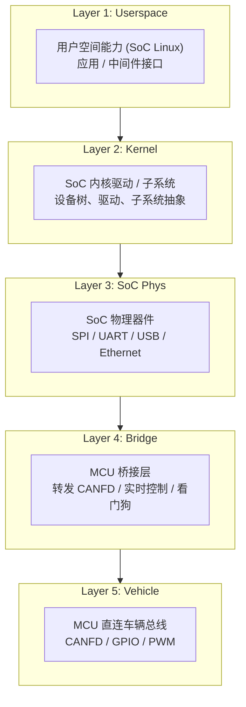
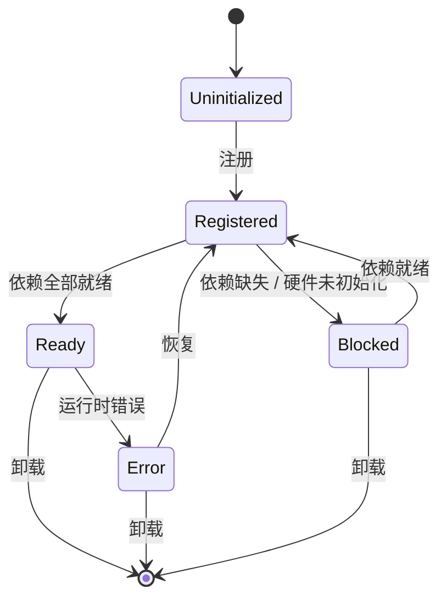

# TBox 平台硬件能力框架

> 本文档定义了 TBox 平台的硬件资源矩阵，以及在嵌入式 Linux 环境下各硬件的**能力分层**与**依赖关系**。
> 各硬件能力以「能力单元」形式组织，供上层系统（中间件 / 应用层）按需引用。

---

## 1. 能力分层模型

TBox 为**双处理器架构**：SoC (AP, 运行 Linux) + MCU (运行 RTOS/Baremetal, 直连车辆总线)。
每个硬件单元按五层模型组织：

```
┌──────────────────────────────────────────────────────┐
│  Userspace   用户空间能力 (SoC Linux)                  │  ← 应用 / 中间件直接调用的接口
├──────────────────────────────────────────────────────┤
│  Kernel      SoC 内核驱动 / 子系统                      │  ← 设备树、驱动、子系统抽象
├──────────────────────────────────────────────────────┤
│  SoC Phys    SoC 物理器件 (SPI/UART/USB/Ethernet/...) │  ← SoC 级外设
├──────────────────────────────────────────────────────┤
│  Bridge      MCU 桥接层                               │  ← 转发 CANFD / 实时控制 / 看门狗
├──────────────────────────────────────────────────────┤
│  Vehicle     MCU 直连的车辆总线与传感器                 │  ← CANFD / 部分 GPIO / PWM
└──────────────────────────────────────────────────────┘
```



---

## 2. 硬件能力矩阵

| 模块　　　　　　　　 | 硬件接口 / 器件　　　　　　　　　　　　　 | 内核层　　　　　　　　　　　　　　　　　　　　　　　　　　　　　　　　　　| 用户空间能力　　　　　　　　　　　　　　　　　　　　　　　　　　　　　| 依赖链　　　　　　　　　　　　　　　　　　　　　　　　　　　　　 |
| ----------------------| -------------------------------------------| ---------------------------------------------------------------------------| -----------------------------------------------------------------------| ------------------------------------------------------------------|
| **CPU**　　　　　　　| SoC (Arm Cortex-A 系列)　　　　　　　　　 | smp, cpufreq, cpuset, irqchip, clk　　　　　　　　　　　　　　　　　　　　| 多核调度 / 频率缩放 / 中断绑定 / 隔离　　　　　　　　　　　　　　　　 | 无（基础平台）　　　　　　　　　　　　　　　　　　　　　　　　　 |
| **DDR**　　　　　　　| LPDDR4 / LPDDR4x　　　　　　　　　　　　　| CMA, memblock, ion, dmabuf　　　　　　　　　　　　　　　　　　　　　　　　| 内存分配策略 / CMA 预留 / 大页 / 内存压力通知　　　　　　　　　　　　 | CPU→DDR 总线　　　　　　　　　　　　　　　　　　　　　　　　　　 |
| **NAND**　　　　　　 | 并行 NAND Flash　　　　　　　　　　　　　 | MTD, UBI, ubifs　　　　　　　　　　　　　　　　　　　　　　　　　　　　　 | OTA 备份分区 / 日志存储 / 冗余引导　　　　　　　　　　　　　　　　　　| CPU→NAND Controller　　　　　　　　　　　　　　　　　　　　　　　|
| **eMMC**　　　　　　 | eMMC 5.1　　　　　　　　　　　　　　　　　| MMC block 层, ext4, squashfs　　　　　　　　　　　　　　　　　　　　　　　| 系统分区 / 应用存储 / 配置持久化　　　　　　　　　　　　　　　　　　　| CPU→eMMC Controller　　　　　　　　　　　　　　　　　　　　　　　|
| **MCU**　　　　　　　| 车规 MCU (e.g. NXP S32K / Infineon TC3xx) | — (无 Linux 内核，运行 RTOS/Baremetal)　　　　　　　　　　　　　　　　　　| CANFD 数据转发 / 实时 IO / 看门狗 / 电源状态上报　　　　　　　　　　　| CPU(SoC) ↔ SPI ↔ MCU　　　　　　　　　　　　　　　　　　　　　　 |
| **CANFD**　　　　　　| MCU 内部 CAN FD Controller + CAN PHY　　　| MCU 固件转发 → SoC SPI → spidev → 中间件 SPI-CAN Gateway → 虚拟 SocketCAN | CAN 总线通信 / 诊断 (ISO 14229) / 固件刷写　　　　　　　　　　　　　　| SoC SPI → MCU SPI Slave → MCU CAN Controller → CAN PHY → CAN Bus |
| **RS485/RS422**　　　| UART + RS485 PHY (自动方向控制)　　　　　 | tty serial, RS485 flags (termios)　　　　　　　　　　　　　　　　　　　　 | 串口通信 / Modbus RTU / 调试控制台　　　　　　　　　　　　　　　　　　| CPU→UART→RS485 PHY　　　　　　　　　　　　　　　　　　　　　　　 |
| **SPI**　　　　　　　| SoC SPI Controller (QSPI/SPI) + MCU SPI　 | spidev, MTD (SPI NOR)　　　　　　　　　　　　　　　　　　　　　　　　　　 | **MCU↔SoC 核间通信** / CANFD 报文转发 / SPI NOR Flash 读写 / 外设控制 | CPU→SPI Controller ↔ MCU SPI　　　　　　　　　　　　　　　　　　 |
| **Ethernet**　　　　 | RGMII / RMII MAC + PHY　　　　　　　　　　| net 子系统, PHY 驱动, ptp　　　　　　　　　　　　　　　　　　　　　　　　 | TCP/IP 协议栈 / VLAN / PTP (gPTP)　　　　　　　　　　　　　　　　　　 | CPU→MAC→PHY→Ethernet Switch　　　　　　　　　　　　　　　　　　　|
| **Ethernet Switch**　| 板载 Switch 芯片 (e.g. KSZ9896 / DP83869) | DSA 驱动框架, bridge, iptables　　　　　　　　　　　　　　　　　　　　　　| 端口转发 / VLAN 划分 / 流量整形 / 镜像　　　　　　　　　　　　　　　　| CPU→MAC→Switch PHY　　　　　　　　　　　　　　　　　　　　　　　 |
| **USB**　　　　　　　| USB 2.0 / 3.0 Host + OTG　　　　　　　　　| usb core, gadget, hub 驱动　　　　　　　　　　　　　　　　　　　　　　　　| USB 主机 (4G/WiFi dongle) / Gadget 模式 (RNDIS/ACM)　　　　　　　　　 | CPU→USB Controller→PHY　　　　　　　　　　　　　　　　　　　　　 |
| **WiFi**　　　　　　 | SDIO / USB WiFi 模组　　　　　　　　　　　| cfg80211, mac80211 / nl80211　　　　　　　　　　　　　　　　　　　　　　　| AP / STA 模式 / WPA2/WPA3 / 热点扫描　　　　　　　　　　　　　　　　　| CPU→SDIO/USB→WiFi Chip　　　　　　　　　　　　　　　　　　　　　 |
| **4G / LTE**　　　　 | USB / PCIe 蜂窝模组　　　　　　　　　　　 | qmi_wwan / cdc_mbim / rndis　　　　　　　　　　　　　　　　　　　　　　　 | PPP / QMI / MBIM 拨号 / AT 指令　　　　　　　　　　　　　　　　　　　 | CPU→USB/PCIe→Modem→SIM 卡　　　　　　　　　　　　　　　　　　　　|
| **GPS (GNSS)**　　　 | UART / I2C GNSS 接收器　　　　　　　　　　| tty serial, pps 子系统, gnss 框架　　　　　　　　　　　　　　　　　　　　 | NMEA 0183 解析 / 定位数据上报 / PPS 脉冲　　　　　　　　　　　　　　　| CPU→UART→GNSS→GPS 天线　　　　　　　　　　　　　　　　　　　　　 |
| **HSM**　　　　　　　| 独立安全芯片 (e.g. SLM9670 / OPTIGA)　　　| spi / i2c 加密驱动, pkcs11　　　　　　　　　　　　　　　　　　　　　　　　| 密钥存储 / 签名验签 / TLS 握手加速　　　　　　　　　　　　　　　　　　| CPU→SPI/I2C→HSM　　　　　　　　　　　　　　　　　　　　　　　　　|
| **Power Management** | PMIC (e.g. PF8100 / AXP)　　　　　　　　　| regulator, power_supply, reboot　　　　　　　　　　　　　　　　　　　　　 | 电压调节 / 低功耗模式 / RTC 唤醒 / 关机　　　　　　　　　　　　　　　 | PMIC→CPU 电源轨　　　　　　　　　　　　　　　　　　　　　　　　　|
| **RTC / UTC**　　　　| SoC 内部 RTC + 外部 RTC 芯片　　　　　　　| rtc 子系统, NTP　　　　　　　　　　　　　　　　　　　　　　　　　　　　　 | 系统时间同步 / 硬件时钟 / 休眠保持　　　　　　　　　　　　　　　　　　| RTC→后备电池→CPU　　　　　　　　　　　　　　　　　　　　　　　　 |
| **PPS**　　　　　　　| GNSS PPS 引脚 + SoC GPIO　　　　　　　　　| pps-gpio 驱动, phc2sys　　　　　　　　　　　　　　　　　　　　　　　　　　| 亚微秒级时间戳 / gPTP 时钟同步　　　　　　　　　　　　　　　　　　　　| GPS→PPS→SoC GPIO→TSN　　　　　　　　　　　　　　　　　　　　　　 |

---

## 3. 能力依赖链总图

以下是关键硬件能力之间的依赖关系（**→** 表示「依赖」）：

### 3.1 时间同步链

```
GPS(GNSS)  ──NMEA──→  UTC 时间同步 ──→  系统时钟 (timedatectl)
    │
    └──PPS GPIO──→  PPS 设备 (/dev/pps0) ──→  phc2sys / ptp4l ──→  gPTP (TSN)
                        │
                        └──→  Ethernet MAC (PTP Hardware Clock)
```

### 3.2 网络链路

```
4G/LTE ──USB/PCIe──→ qmi_wwan ──→ 蜂窝网 (WAN)
WiFi   ──SDIO/USB──→ wlan0    ──→ 无线网 (LAN/WAN)
Ethernet──RGMII──→ eth0       ──→ 有线网 (VLAN 管理)
                    │
Ethernet Switch──DSA──→ lan1~lanN ──→ 内部设备互联
```

### 3.3 存储链路

```
eMMC ──MMC──→ /dev/mmcblk0 ──→ 系统分区 (rootfs / app)
NAND ──MTD──→ /dev/mtd*    ──→ OTA 备份 / 日志 / UBIFS
SPI NOR──SPI──→ /dev/mtd*  ──→ Bootloader / 环境变量
```

### 3.4 安全链路

```
HSM ──SPI/I2C──→ pkcs11 引擎 ──→ TLS / 签名 / 加密
                    │
HSM ─────→ 密钥注入 ──→ 安全启动校验 ──→ 固件验签
                    │
HSM ─────→ V2X 安全证书存储 ──→ C-V2X 安全通信
```

### 3.5 通信链路

```
CAN Bus ──CAN PHY──→ MCU CAN FD Controller ──MCU SPI──→ SoC SPI (spidev)
    │                                                        │
    │              ┌─────────────────────────────────────────┘
    │              ▼
    │     SPI-CAN Gateway (中间件) ──虚拟 CAN──→ 应用层 (UDS / 路由)
    │
RS485 ──tty──→ /dev/tty*     ──→ Modbus / 串口外设
SPI   ──spidev──→ /dev/spidev*   ──→ MCU 通信 / 传感器 / SPI NOR
```

### 3.6 功耗管理链路

```
PMIC ──regulator──→ CPU 电压轨 ──→ cpufreq / 动态调频
PMIC ──power_supply──→ 电池管理 ──→ 电量上报
PMIC ──wakeup──→ RTC 闹钟 / GPIO 唤醒 ──→ 深睡眠 → 定时唤醒
```

---

## 4. 能力单元清单

每个能力单元是一个可注册、可查询的功能抽象，对应一个 **"能力 ID + 提供者 + 接口路径 + 依赖声明"**。

### 4.1 CPU

| 属性 | 值 |
|------|-----|
| 能力 ID | cpu |
| 能力名称 | CPU 计算能力 |
| 内核接口 | /sys/devices/system/cpu/, /sys/bus/cpu/ |
| 设备节点 | cpu0 ~ cpuN |
| 提供的能力 | 算力 / 核心数 / 频率缩放 / 中断控制 |
| 依赖 | SoC 总线→DDR→电源 |

### 4.2 存储类

| 能力 ID | 名称 | 设备节点 | 内核子系统 | 典型用途 |
|---------|------|---------|-----------|---------|
| storage.emmc | eMMC 存储 | /dev/mmcblk0 | MMC block | 系统 / 应用 / 配置 |
| storage.nand | NAND 存储 | /dev/mtd* | MTD + UBI | OTA 备份 / 日志 |
| storage.spinor | SPI NOR Flash | /dev/mtd* | MTD | Bootloader / 环境变量 |

### 4.3 MCU（桥接处理器）

| 属性 | 值 |
|------|-----|
| 能力 ID | mcu.bridge |
| 能力名称 | MCU 桥接层 |
| 通信链路 | SPI（SoC ↔ MCU） |
| 运行环境 | RTOS / Baremetal（无 Linux） |
| 提供的能力 | CANFD 透明转发 / 实时 IO / 电源状态管理 / 硬件看门狗 |
| 依赖 | SoC SPI ↔ MCU SPI → 电源 |

### 4.4 CAN

| 属性 | 值 |
|------|-----|
| 能力 ID | can.bus |
| 能力名称 | CAN/CANFD 总线 |
| 设备节点 | 中间件虚拟 can 接口 (vcan/spican) |
| 内核子系统 | SocketCAN (net/can) — MCU 通过 SPI 转发到 SoC 后注入 |
| 提供的能力 | 标准帧 / 扩展帧 / CAN FD / 波特率动态配置 / 总线错误检测 |
| 依赖 | SoC SPI ↔ MCU SPI → MCU CAN Controller → CAN PHY |

### 4.5 网络类

| 能力 ID | 名称 | 设备节点 | 内核子系统 | 典型用途 |
|---------|------|---------|-----------|---------|
| net.eth | 以太网 | eth0 | net + PHY | 有线 IP 通信 |
| net.switch | 交换机 | lan1~N (DSA) | DSA bridge | 端口转发 / VLAN |
| net.wifi | WiFi | wlan0 | cfg80211 | 无线 AP/STA |
| net.cellular | 4G/LTE | wwan0 | qmi_wwan / MBIM | 蜂窝数据 |
| net.ptp | PTP 硬件时间戳 | ethtool -T eth0 | PTP clock | gPTP 时间同步 |

### 4.6 时间类

| 能力 ID | 名称 | 设备节点 | 内核子系统 | 典型用途 |
|---------|------|---------|-----------|---------|
| time.rtc | RTC 实时时钟 | /dev/rtc0 | rtc | 系统时间 / 唤醒闹钟 |
| time.pps | PPS 脉冲 | /dev/pps0 | pps-gpio | 精确秒脉冲 / 时钟同步 |
| time.gps | GNSS 接收器 | /dev/ttyGPS / /dev/gnss0 | gnss + tty | 定位 / UTC 时间 |

### 4.7 安全类

| 能力 ID | 名称 | 设备节点 | 内核子系统 | 典型用途 |
|---------|------|---------|-----------|---------|
| security.hsm | 硬件安全模块 | /dev/spidev* / /dev/i2c-* | crypto + pkcs11 | 密钥管理 / 签名 / TLS |
| security.otp | 一次性可编程 | SoC eFuse | nvmem | 芯片唯一标识 / 存储密钥 |
| security.seboot | 安全启动 | — | Trusted Firmware | 逐级验签启动链 |

### 4.8 串行通信类

| 能力 ID | 名称 | 设备节点 | 内核子系统 | 典型用途 |
|---------|------|---------|-----------|---------|
| serial.rs485 | RS485 总线 | /dev/ttyRS* | tty + RS485 flags | Modbus / 工业控制 |
| serial.rs232 | RS232 | /dev/ttyS* | tty | 调试 / 旧设备通信 |
| serial.spi | SPI | /dev/spidev* | spidev | 外设传感器 / ADC |

### 4.9 电源管理类

| 能力 ID | 名称 | 设备节点 | 内核子系统 | 典型用途 |
|---------|------|---------|-----------|---------|
| power.pmic | PMIC 电源管理 | /sys/class/regulator/ | regulator | 电压 / 电流控制 |
| power.wakeup | 唤醒源管理 | /sys/kernel/wakeup | wakeup | 深睡眠 / 唤醒 |
| power.battery | 电池管理 | /sys/class/power_supply/ | power_supply | 电量 / 充放电 |

### 4.10 IO 扩展

| 能力 ID | 名称 | 设备节点 | 内核子系统 | 典型用途 |
|---------|------|---------|-----------|---------|
| gpio | GPIO | /sys/class/gpio/ / libgpiod | gpio / gpiod | 数字 IO / 中断 |
| adc | ADC | /sys/bus/iio/ | IIO | 模拟量采集 |
| pwm | PWM | /sys/class/pwm/ | pwm | 背光 / 电机控制 |

---

## 5. 能力注册与查询接口（设计）

能力管理系统对外提供以下接口（后续将展开实现细节）：

```
reg_capability(id, provider, deps, ops)   — 注册一个能力单元
get_capability(id) → capability_info     — 查询能力详情
get_dep_chain(id) → [capability_id]      — 获取能力的完整依赖链
check_cap_ready(id) → bool               — 检查能力是否就绪
cap_status(id) → {ready, blocked, error} — 获取能力状态
list_capabilities() → [capability_id]     — 列出所有已注册能力
```

### 能力状态机

```
                 ┌──────────────────┐
                 │  Uninitialized   │
                 └────────┬─────────┘
                          │ 注册
                          ▼
                 ┌──────────────────┐
          ┌─────│   Registered     │
          │     └────────┬─────────┘
          │              │ 依赖全部就绪
          │              ▼
          │     ┌──────────────────┐
          │     │     Ready        │ ←── 正常使用
          │     └────────┬─────────┘
          │              │ 运行时错误
          │              ▼
          │     ┌──────────────────┐
          │     │     Error        │
          │     └──────────────────┘
          │
          │     ┌──────────────────┐
          └─────│    Blocked       │ ←── 依赖缺失 / 硬件未初始化
                └──────────────────┘
```



---

## 6. 硬件资源清单（模板）

供 BSP / 硬件团队填写：

| 硬件 | 芯片型号 | 挂载总线 | 中断号 | DMA | 设备树状态 |
|------|---------|---------|--------|-----|-----------|
| CPU | TBD | — | — | — | status = okay |
| DDR | TBD | — | — | TBD | 内存节点 |
| eMMC | TBD | mmc0 | TBD | TBD | &mmc0 |
| NAND | TBD | nfc | TBD | TBD | &nand |
| MCU | TBD | SPI (SoC↔MCU) | TBD | — | MCU 固件加载 |
| CANFD | TBD | MCU CAN Controller | TBD | TBD | 通过 MCU 转发 |
| RS485 | TBD | uart0 | TBD | TBD | &uart0 |
| SPI | TBD | spi0 | TBD | TBD | &spi0 |
| Ethernet | TBD | eth0 | TBD | TBD | &mac0 |
| Ethernet Switch | TBD | mdio0 | TBD | TBD | 由 DSA 驱动注册 |
| USB | TBD | usb0 | TBD | TBD | &usb0 |
| WiFi | TBD | sdio0/usb | TBD | TBD | TBD |
| 4G | TBD | usb1/pcie | TBD | TBD | TBD |
| GPS | TBD | uart1 | TBD | — | &uart1 |
| HSM | TBD | spi1 | TBD | — | &spi1 |
| PMIC | TBD | i2c0 | TBD | — | &i2c0 |
| RTC | TBD | i2c0/spi | TBD | — | &rtc |

---

## 7. 修订记录

| 版本 | 日期 | 修改内容 | 修改人 |
|------|------|---------|--------|
| v0.1 | — | 初版硬件能力框架结构 | — |
| v0.2 | — | 修正为 SoC+MCU 双处理器模型；CANFD 更正为 MCU CAN→SPI→SoC 转发路径；新增 MCU 桥接能力单元 | — |
