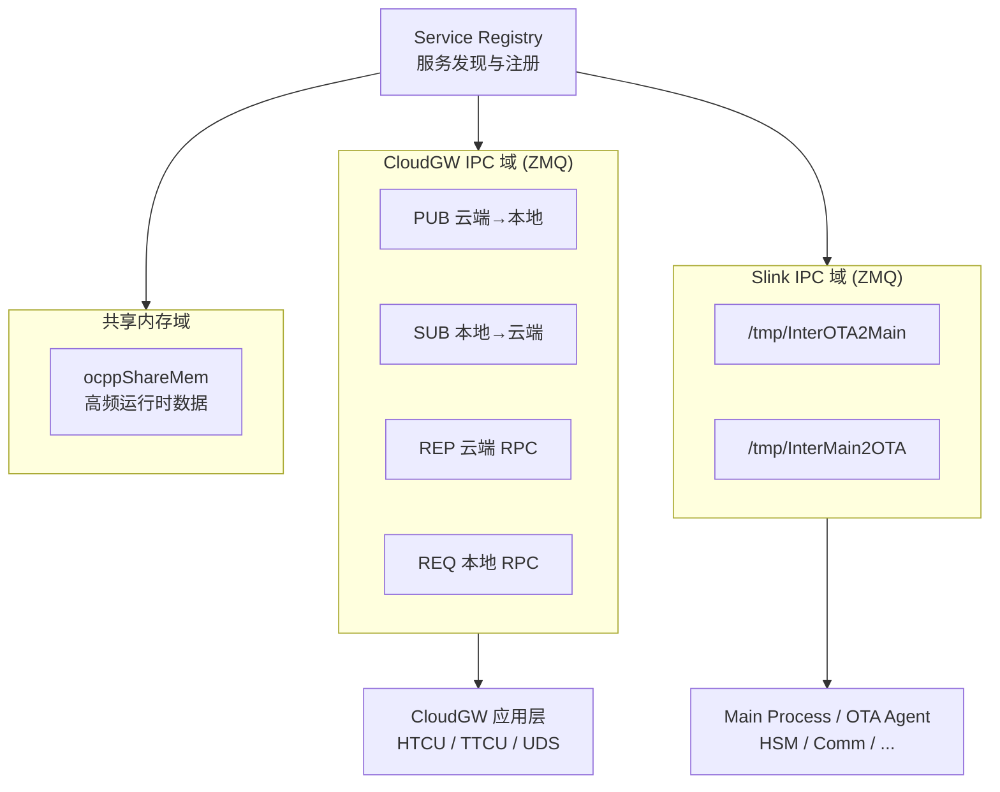
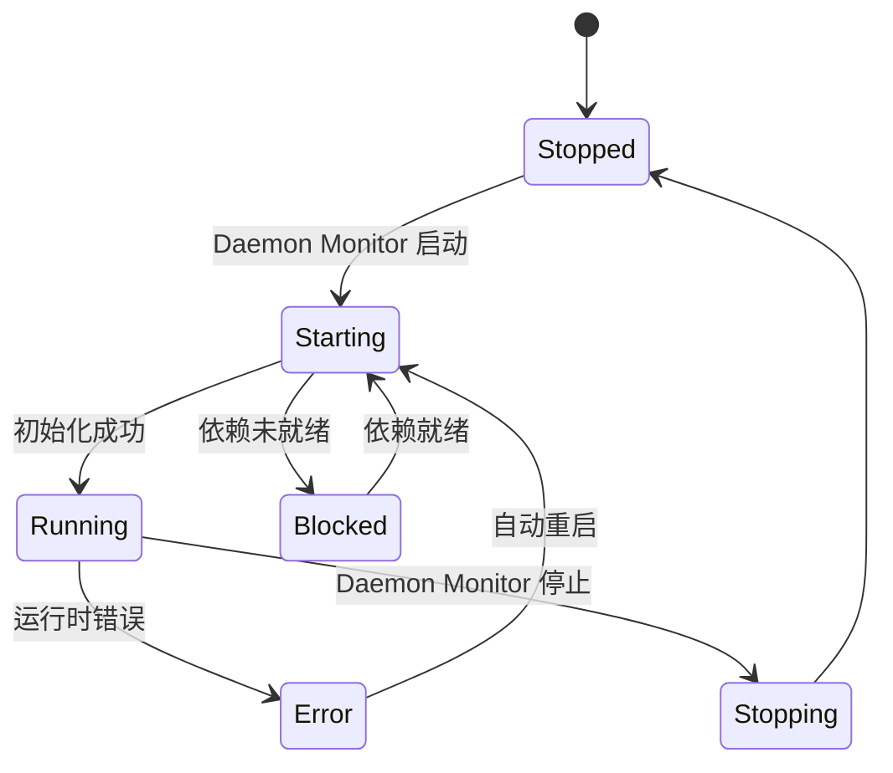

# TBox 中间件服务架构设计

> 本文档定义 TBox 中间件软件层的服务架构，每个服务与 `hardware.md` 中的硬件能力**强关联绑定**。
> 中间件运行于 SoC Linux 用户空间，通过 SPI 与 MCU 桥接层通信，向下屏蔽硬件差异，向上提供统一服务接口。

---

## 1. 总体架构

```
┌─────────────────────────────────────────────────────────────────────┐
│                         Application Layer                           │
│    (用户业务应用 / 云平台对接 / 远程诊断 / 数据上报)                   │
├─────────────────────────────────────────────────────────────────────┤
│  ┌──────────┐ ┌──────────┐ ┌──────────┐ ┌──────────┐ ┌──────────┐  │
│  │ CloudGW  │ │ HTTPS    │ │ UDS      │ │ OTA      │ │ …        │  │
│  │ (MQTTS   │ │ Client   │ │ Server   │ │ Agent    │ │          │  │
│  │ 网关+ZMQ)│ │          │ │          │ │          │ │          │  │
│  └────┬─────┘ └────┬─────┘ └────┬─────┘ └────┬─────┘ └──────────┘  │
│       │            │            │            │                      │
├───────┴────────────┴────────────┴────────────┴─────────────────────┤
│                      Middleware Services Layer                       │
│                                                                      │
│  ┌──────────────────────────────────────────────────────────────┐   │
│  │                   IPC 总线 (进程间通信)                         │   │
│  │  UNIX Domain Socket / ZeroMQ / 共享内存 / 消息队列             │   │
│  └──────┬──────┬──────┬──────┬──────┬──────┬──────┬────────────┘   │
│         │      │      │      │      │      │      │                 │
│  ┌──────┴┐ ┌───┴───┐ ┌┴─────┐ ┌┴─────┐ ┌┴─────┐ ┌┴─────┐          │
│  │ Daemon│ │SPI-CAN│ │Comm  │ │HSM   │ │Time  │ │Log   │          │
│  │Monitor│ │Gateway│ │Manager│ │Server│ │Sync  │ │Mgr   │          │
│  └───────┘ └───────┘ └──────┘ └──────┘ └──────┘ └──────┘          │
│                                                                      │
├─────────────────────────────────────────────────────────────────────┤
│                    Linux Kernel / Drivers                            │
│  spidev │ virtual CAN │ tty │ net │ crypto │ pps-gpio │ gpiod │…   │
├─────────────────────────────────────────────────────────────────────┤
│                       Hardware Platform                              │
│  SoC: SPI  UART  USB  Ethernet  SDIO  GPIO  PPS                     │
│       │                                                             │
│       ├── SPI ──→ MCU ──→ CANFD / 实时 IO / 看门狗                  │
│       │                                                             │
│       └── 直连外设: RS485 · WiFi · 4G · GPS · HSM · PMIC           │
└─────────────────────────────────────────────────────────────────────┘
```

---

## 2. 中间件服务清单

每个服务声明其**硬件依赖**（对应 `hardware.md` 能力 ID）和**服务依赖**。

| 服务 | 能力 ID | 硬件资源 | 内核接口 | 功能概要 |
|------|---------|---------|---------|---------|
| **Daemon Monitor** | `cpu`, `storage.emmc` | CPU, eMMC | `/proc`, `signalfd` | 进程生命周期管理 / 看门狗 / 崩溃恢复 |
| **SPI-CAN Gateway** | `serial.spi`, `mcu.bridge`, `can.bus` | SPI, MCU | `/dev/spidev`, `vcan` | MCU→SoC CANFD 转发 / 协议解析 / 虚拟 CAN |
| **Comm Manager** | `net.*`, `power.pmic` | 4G, WiFi, ETH, PMIC | `qmi_wwan`, `cfg80211`, `net` | 链路管理 / 热插拔 / QoS / 信号监测 |
| **CloudGW** | `net.*`, `security.hsm`, `cpu` | 4G/ETH/WiFi, HSM | `net.*`, IPC→HSM | MQTTS 云端网关 / ZeroMQ 本地分发 / 消息队列桥接 |
| **UDS Server** | `can.bus`, `cpu` | CAN (via SPI-CAN GW) | SocketCAN (vcan) | ISO 14229 诊断 / 会话管理 / DID 读写 |
| **HSM Server** | `security.hsm` | HSM 芯片 | `/dev/spidev*`, `pkcs11` | 密钥管理 / 签名验签 / TLS 加速 |
| **Time Sync** | `time.gps`, `time.pps`, `time.rtc` | GPS, PPS, RTC | `/dev/pps*`, `/dev/rtc*` | NTP / PTP / gPTP / UTC 同步 |
| **Security Guard** | `security.hsm`, `cpu` | HSM, CPU | `audit`, `seccomp` | 访问控制 / 策略执行 / 安全审计 |
| **OTA Agent** | `storage.emmc`, `storage.nand`, `net.*` | eMMC, NAND, 4G/ETH | `/dev/mmcblk*`, `/dev/mtd*` | 差分升级 / 分区管理 / 回滚 |
| **Log Manager** | `storage.nand`, `storage.emmc` | NAND, eMMC | `ext4`, `ubifs` | 系统日志 / 故障记录 / 日志轮转 |

---

## 3. 各服务详细设计

### 3.1 Daemon Monitor（守护进程管理器）

**硬件依赖链**：`cpu` → `storage.emmc` → `power.pmic` (看门狗)

```
┌──────────────────────────────────────┐
│           Daemon Monitor              │
│  ┌────────────┐  ┌────────────────┐   │
│  │ 进程生命周期  │  │ 硬件看门狗刷新   │   │
│  │ 启动/停止/重启│  │ (MCU/PMIC)    │   │
│  └────────────┘  └────────────────┘   │
│  ┌────────────┐  ┌────────────────┐   │
│  │ 崩溃检测     │  │ 健康状态发布    │   │
│  │ (crashdump) │  │ (→ IPC)       │   │
│  └────────────┘  └────────────────┘   │
└──────────────────────────────────────┘
```

- **职责**：所有中间件服务的启动顺序编排、运行状态监控、崩溃自动重启
- **启停顺序**：
  1. `Daemon Monitor` 自举（init 进程）
  2. `SPI-CAN Gateway`（依赖 SPI 设备就绪）
  3. `IPC Bus` 建立（ZMQ + Slink 通道）
  4. `HSM Server`（依赖 SPI 设备就绪）
  5. `Time Sync`（依赖 RTC/GPS 就绪）
  6. `Comm Manager`（依赖网络设备就绪）
  7. **`CloudGW`**（依赖 Comm Manager + HSM Server，MQTTS 就绪）
  8. `UDS Server`（依赖 SPI-CAN Gateway + CloudGW ZMQ 通道）
  9. `Security Guard`（依赖 HSM 就绪）
  10. `OTA Agent`、`Log Manager`（基础设施就绪后启动）
  11. **应用层**：`HTCU`（依赖 CloudGW + UDS Server）、`TTCU`（依赖 HTCU + SPI-CAN Gateway）
- **依赖资源**：
  - `/dev/spidev*` → SPI 设备存在性检测（MCU 通信就绪标志）
  - `/sys/class/gpio/` → MCU 心跳 GPIO（MCU 存活检测）
  - `signalfd` / `inotify` → 子进程退出通知

---

### 3.2 SPI-CAN Gateway（SPI-CAN 网关）

**硬件依赖链**：`serial.spi` → `mcu.bridge` → `can.bus`

```
MCU (CANFD) ──SPI──→ /dev/spidev ──→ SPI-CAN Gateway
                                           │
                                    ┌──────┴──────┐
                                    │ 协议解析引擎   │
                                    │ (MCU 私有协议) │
                                    └──────┬──────┘
                                           │
                                    ┌──────┴──────┐
                                    │ CAN 帧构造器  │
                                    └──────┬──────┘
                                           │
                                    ┌──────┴──────┐
                                    │ 注入虚拟 CAN  │
                                    │ (vcan0)       │
                                    └──────┬──────┘
                                           │
                                    SocketCAN 接口 ←→ UDS Server / 应用
```

- **职责**：
  1. 通过 `/dev/spidev*` 与 MCU 建立 SPI 通信通道（全双工）
  2. 解析 MCU 私有 SPI 协议帧头（含消息类型、CAN 通道、时间戳、DLC、数据）
  3. 将 CANFD 标准帧/扩展帧转换为 `struct canfd_frame`
  4. 通过 `write()` 注入虚拟 CAN 设备（`vcan` 或 `socketcand`）
  5. 反向路径：应用层发送的 CAN 帧 → SPI 写入 → MCU 转发到 CAN 总线
- **协议格式**（示意）：

  ```
  ┌──────┬──────┬──────┬──────┬──────┬──────────┬──────────┐
  │ SOF  │ Len  │ Chn  │ Type │ DLC  │ Data(64B)│ CRC      │
  │ 1B   │ 1B   │ 1B   │ 1B   │ 1B   │ 0-64B    │ 2B       │
  └──────┴──────┴──────┴──────┴──────┴──────────┴──────────┘
  ```

- **关键参数**：
  - SPI 时钟频率：≥ 10 MHz（满足 CANFD 高负载需求）
  - SPI 模式： Mode 0 (CPOL=0, CPHA=0) 或由 MCU 固件定义
  - DMA 使能：降低 CPU 占用
- **依赖资源**：
  - `/dev/spidev*` → SPI 字符设备
  - `/dev/vcan0`（或 `socketcand`）→ 虚拟 CAN 设备
  - MCU 侧需实现 SPI 从机协议栈

---

### 3.3 Comm Manager（通信管理器）

**硬件依赖链**：`net.eth` / `net.cellular` / `net.wifi` → `power.pmic`

```
┌──────────────────────────────────────────┐
│            Comm Manager                    │
│  ┌──────────┐ ┌──────────┐ ┌──────────┐   │
│  │ 链路检测   │ │ 连接管理  │ │ QoS/路由 │   │
│  │ eth0/     │ │ PPPoE/   │ │ 策略路由 │   │
│  │ wwan0/    │ │ DHCP/    │ │ 带宽管理  │   │
│  │ wlan0     │ │ 拨号     │ │          │   │
│  └──────────┘ └──────────┘ └──────────┘   │
│  ┌──────────┐ ┌──────────┐ ┌──────────┐   │
│  │ 信号质量  │ │ 热插拔    │ │ 状态发布  │   │
│  │ (RSSI/   │ │ 检测     │ │ (→ IPC)  │   │
│  │ 小区ID)  │ │          │ │          │   │
│  └──────────┘ └──────────┘ └──────────┘   │
└──────────────────────────────────────────┘
```

- **职责**：
  1. 监测 `wwan0`（4G）、`eth0`（以太网）、`wlan0`（WiFi）链路状态
  2. 4G 拨号管理（QMI/MBIM/PPP），PIN 码管理，APN 配置
  3. 策略路由（默认路由 → 4G WAN，内部 VLAN → WiFi AP）
  4. 信号质量监测（RSSI/RSRP/SINR）并通过 IPC 发布
  5. 网口热插拔（USB 4G 模组/以太网线缆）检测与自动重连
- **依赖资源**：
  - `wwan0` → `qmi_wwan` 或 `cdc_mbim` 驱动
  - `wlan0` → `cfg80211` / `nl80211`
  - `eth0` → `net` 子系统
  - `netlink` → 内核网络事件通知
  - `/sys/class/net/*` → 接口状态轮询

---

### 3.4 UDS Server（统一诊断服务）

**硬件依赖链**：`can.bus`（经过 SPI-CAN Gateway 间接依赖 `serial.spi` → `mcu.bridge`）

```
CAN Bus ──MCU──→ SPI ──→ SPI-CAN GW ──→ vcan0 ──→ UDS Server
                                                      │
                                           ┌──────────┴──────────┐
                                           │   ISO 14229 协议栈    │
                                           │  ┌────────────────┐  │
                                           │  │ 会话控制 (0x10)  │  │
                                           │  │ 安全访问 (0x27)  │  │
                                           │  │ 通信控制 (0x28)  │  │
                                           │  │ 读取DID  (0x22)  │  │
                                           │  │ 写入DID  (0x2E)  │  │
                                           │  │ 例程控制 (0x31)  │  │
                                           │  │ 上传下载 (0x34)  │  │
                                           │  └────────────────┘  │
                                           └──────────────────────┘
```

- **职责**：
  1. 通过 SocketCAN `PF_CAN` 接口监听诊断请求（物理寻址/功能寻址）
  2. 实现 ISO 14229-1 规定的全部强制服务（见下表）
  3. DID（Data Identifier）读写：车辆 VIN、硬件版本、固件版本、DTC 等
  4. 安全访问（0x27）：通过 HSM Server 完成种子-密钥算法
  5. 例程控制（0x31）：ECU 复位、DTC 清除、IO 控制
  6. 多会话管理（默认/编程/扩展）
- **UDS 服务实现矩阵**：

| SID | 服务 | 实现 | 依赖 HSM |
|-----|------|------|---------|
| 0x10 | DiagnosticSessionControl | ✅ | — |
| 0x11 | ECUReset | ✅ | — |
| 0x14 | ClearDiagnosticInformation | ✅ | — |
| 0x19 | ReadDTCInformation | ✅ | — |
| 0x22 | ReadDataByIdentifier | ✅ | — |
| 0x23 | ReadMemoryByAddress | ✅ | — |
| 0x27 | SecurityAccess | ✅ | ✅ 种子-密钥 |
| 0x28 | CommunicationControl | ✅ | — |
| 0x2E | WriteDataByIdentifier | ✅ | — |
| 0x2F | InputOutputControlByIdentifier | ✅ | — |
| 0x31 | RoutineControl | ✅ | — |
| 0x34 | RequestDownload | ✅ (OTA) | ✅ 签名校验 |
| 0x35 | RequestUpload | ✅ | — |
| 0x36 | TransferData | ✅ (OTA) | — |
| 0x37 | RequestTransferExit | ✅ (OTA) | — |
| 0x3E | TesterPresent | ✅ | — |

- **依赖资源**：
  - `PF_CAN` socket → `vcan0` 或 `can0`
  - IPC → HSM Server（安全访问鉴权）
  - IPC → SPI-CAN Gateway（CAN 发送反向路径）

---

### 3.5 HSM Server（硬件安全服务）

**硬件依赖链**：`security.hsm`

```
HSM Chip (SPI/I2C) ───→ /dev/spidev* ───→ HSM Server
                                               │
                                    ┌──────────┴──────────┐
                                    │   PKCS#11 封装层      │
                                    │  ┌────────────────┐  │
                                    │  │ C_Encrypt      │  │
                                    │  │ C_Decrypt      │  │
                                    │  │ C_Sign         │  │
                                    │  │ C_Verify       │  │
                                    │  │ C_GenerateKey  │  │
                                    │  └────────────────┘  │
                                    └──────────┬──────────┘
                                               │
                                    ┌──────────┴──────────┐
                                    │   IPC 服务接口        │
                                    │   (UNIX Domain Socket)│
                                    └──────────────────────┘
                                              │
                    ┌─────────────────────────┼──────────────┐
                    ▼                         ▼              ▼
              MQTTS Client            HTTPS Client    UDS Server
              (TLS 私钥签名)          (TLS 私钥签名)   (种子-密钥)
```

- **职责**：
  1. 封装 HSM 芯片的 SPI/I2C 通信协议
  2. 提供 PKCS#11 标准接口（`pkcs11-engine` for OpenSSL）
  3. 关键操作：密钥对生成、非对称签名/验签、对称加解密、密钥存储
  4. 安全策略：密钥不可导出、使用次数限制、会话审计
  5. 通过 IPC（UNIX Domain Socket）向其他服务暴露安全能力
- **可用密钥槽位**：

| 槽位 | 用途 | 算法 | 生命周期 |
|------|------|------|---------|
| Key-0 | 设备身份证书私钥 | ECDSA/secp256r1 | 预置/不可变 |
| Key-1 | V2X 证书私钥 | ECDSA/secp256r1 | OTA 更新 |
| Key-2 | TLS Server 私钥 | RSA-2048/ECDSA | OTA 更新 |
| Key-3 | UDS 安全访问密钥 | AES-128 | 预置 |
| Key-4 | 固件签名公钥哈希 | SHA-256 | 不可变 |
- **依赖资源**：
  - `/dev/spidev*` 或 `/dev/i2c-*` → HSM 芯片设备
  - `cryptodev` / `af_alg` → 内核加密卸载接口（可选）

---

### 3.6 CloudGW — MQTTS 云端网关

> CloudGW 是 MQTTS Client 服务的具体实现，详见 [CloudGW.md](./CloudGW.md)。

**硬件依赖链**：`net.cellular` / `net.eth` / `net.wifi` + `security.hsm`

```
Comm Manager ──链路状态──→ CloudGW (MQTTS 网关)
                              │
              ┌───────────────┴────────────────┐
              │  ① MQTT 引擎 (Paho/Mosquitto)    │
              │     + OpenSSL engine → HSM Server │
              ├───────────────────────────────────┤
              │  ② Topic 路由 (Pub/Sub + Req/Resp) │
              ├───────────────────────────────────┤
              │  ③ 消息队列 (MQTT ⇄ ZMQ 桥接)     │
              ├───────────────────────────────────┤
              │  ④ ZeroMQ 网关 (PUB/SUB/REQ/REP)  │
              └───────────────┬───────────────────┘
                              │ ZeroMQ (跨进程 IPC)
                              │
              ┌───────────────┼──────────────┬─────────────┐
              │               │              │             │
              ▼               ▼              ▼             ▼
          UDS Server    GPS Daemon      OTA Agent    其他本地进程
         (诊断上报)    (定位上报)     (OTA 触发)
```

- **职责**：
  1. 通过 4G/以太网/WiFi 与云端 MQTT Broker 建立 TLS 连接（客户端证书认证）
  2. TLS 握手时调用 HSM Server 完成私钥签名运算
  3. **ZeroMQ PUB** 发布云端下行消息，供本地进程 SUB
  4. **ZeroMQ SUB** 订阅本地进程 PUB 的数据，转发到云端
  5. **ZeroMQ REP** 处理本地 RPC 请求
  6. **ZeroMQ REQ** 向本地服务发起 RPC 请求
  7. MQTT 事件与 ZeroMQ 之间通过**消息队列**异步桥接
  8. 断线重连：指数退避 + 会话持久化
- **Topic 约定**（详见 [CloudGW.md](./CloudGW.md)）：
  - 发布上行：`tbox/{device_id}/telemetry/{type}`
  - 订阅下行：`cloud/{device_id}/command/{type}`
  - RPC 请求：`tbox/{device_id}/rpc/request/{method}`
  - RPC 响应：`cloud/{device_id}/rpc/response/{method}`
- **依赖资源**：
  - `net.*` → 网络接口（通过 Comm Manager 提供）
  - IPC → HSM Server（TLS 签名、证书读取）
  - ZeroMQ → 本地进程间通信（Unix Socket / TCP）

---

### 3.7 HTTPS Client / Server

**硬件依赖链**：`net.cellular` / `net.eth` / `net.wifi` + `security.hsm`

```
Comm Manager ──→ HTTPS Client (对外请求)
                    │
            ┌───────┴────────┐
            │   TLS + HSM    │
            │  REST API 调用  │
            │  (JSON/PROTOBUF)│
            └────────────────┘

                HTTPS Server (本地管理)
                    │
            ┌───────┴────────┐
            │  本地 Web 管理   │
            │  端口: 8443     │
            │  mTLS (HSM)    │
            └────────────────┘
```

- **职责**（Client）：
  1. RESTful API 请求（上报数据、拉取配置）
  2. TLS Client 证书 → HSM Server 签名
  3. 支持 OAuth2 / JWT 鉴权
- **职责**（Server）：
  1. 本地诊断 Web 服务（工程师调试）
  2. mTLS 双向认证（HSM Server 验签客户端证书）
  3. 本地 OTA 触发接口
- **依赖资源**：
  - `net.*` → 网络接口
  - IPC → HSM Server

---

### 3.8 Time Sync（时间同步服务）

**硬件依赖链**：`time.gps` → `time.pps` → `time.rtc`

```
GPS ──NMEA──→ gpsd / nmea_parse ──→ chronyd / ntpd
 │                                      │
 │                                      ├──→ 系统时钟 (CLOCK_REALTIME)
 │                                      │
 └──PPS GPIO──→ /dev/pps0 ───→ phc2sys ──→ gPTP ──→ Ethernet PHC
                                             │
                                             └──→ TSN 时间同步
```

- **职责**：
  1. GPS NMEA 解析 → UTC 时间提取 → `chronyd` 时间校正
  2. PPS 脉冲 `/dev/pps0` 锁定系统时钟到亚微秒精度
  3. gPTP (IEEE 802.1AS) 通过以太网 PTP Hardware Clock 分发精确时间
  4. RTC 维护：NTP 校正后写回 `/dev/rtc0`，断电保持
- **依赖资源**：
  - `/dev/ttyGPS*` 或 `/dev/gnss0` → GPS 设备
  - `/dev/pps0` → PPS 字符设备
  - `/dev/rtc0` → RTC 设备
  - `eth0` PTP Hardware Clock → `ethtool -T eth0`

---

### 3.9 OTA Agent（远程升级代理）

**硬件依赖链**：`storage.emmc` + `storage.nand` + `net.*` + `security.hsm`

```
云端平台 ──MQTTS/HTTPS──→ OTA Agent
                              │
                    ┌─────────┴──────────┐
                    │   升级包下载          │
                    │   (差分/全量)        │
                    └─────────┬──────────┘
                              │
                    ┌─────────┴──────────┐
                    │  签名校验            │
                    │  (→ HSM Server)     │
                    └─────────┬──────────┘
                              │
                    ┌─────────┴──────────┐
                    │  分区写入            │
                    │  eMMC: 主系统/备系统  │
                    │  NAND: 备份/日志     │
                    └────────────────────┘
```

- **职责**：
  1. 通过 MQTTS/HTTPS 接收升级通知并下载镜像
  2. 校验固件签名（调用 HSM Server 验签）
  3. 双分区切换（A/B slot on eMMC）
  4. 失败回滚：引导计数 + NAND 备份分区
  5. 升级进度通过 IPC 发布
- **依赖资源**：
  - `/dev/mmcblk0p*` → eMMC 分区
  - `/dev/mtd*` → NAND MTD 分区
  - IPC → HSM Server（签名校验）
  - IPC → Comm Manager（网络通道）

---

### 3.10 Log Manager（日志管理）

**硬件依赖链**：`storage.nand` + `storage.emmc`

```
各服务 ──IPC──→ Log Manager
                    │
            ┌───────┴────────┐
            │  日志聚合 + 分类  │
            │  (错误/警告/调试) │
            └───────┬────────┘
                    │
            ┌───────┴────────┐
            │  日志持久化      │
            │  NAND: 循环日志  │
            │  eMMC: 故障快照  │
            │  Syslog: 系统日志 │
            └────────────────┘
```

- **职责**：
  1. 接收各服务的 IPC 日志消息
  2. 分类存储（NAND 循环日志、eMMC 故障快照）
  3. 日志轮转（大小/时间策略）
  4. 故障时自动触发 dump 保存（结合 Daemon Monitor 的 crash 检测）
- **依赖资源**：
  - NAND UBIFS 分区 → 循环日志
  - eMMC ext4 分区 → 持久化故障快照

---

## 4. IPC 总线设计

### 4.1 通信拓扑

所有 TBox 进程间通信统一基于 **ZeroMQ**，划分为两个域（详见 `Slink.md`）：

```
                              ┌─────────────────────┐
                              │   Service Registry  │
                              │  (服务发现与注册)    │
                              └──────────┬──────────┘
                                         │
              ┌──────────────────────────┼──────────────────────┐
              │                          │                      │
              ▼                          ▼                      ▼
┌─────────────────────────┐  ┌──────────────────────┐  ┌─────────────────┐
│  CloudGW IPC 域 (ZMQ)    │  │  Slink IPC 域 (ZMQ)   │  │  共享内存域      │
│                          │  │                       │  │                  │
│  ipc:///tmp/tbox_cgw_*   │  │  /tmp/InterOTA2Main  │  │  ocppShareMem    │
│                          │  │  /tmp/InterMain2OTA  │  │                  │
│  PUB  云端→本地           │  │                       │  │  (高频运行时数据) │
│  SUB  本地→云端           │  │  状态帧 / OTA 进度     │  │                  │
│  REP  云端 RPC           │  │                       │  │                  │
│  REQ  本地 RPC           │  │                       │  │                  │
└──────────┬───────────────┘  └────────┬─────────────┘  └─────────────────┘
           │                           │
           │                           │
           ▼                           ▼
┌─────────────────────┐  ┌──────────────────────────────┐
│ CloudGW 应用层       │  │ Main Process / OTA Agent /  │
│ HTCU / TTCU / UDS   │  │ 中间件服务 (HSM / Comm / …)  │
└─────────────────────┘  └──────────────────────────────┘
```



### 4.2 IPC 消息协议

| 字段 | 类型 | 说明 |
|------|------|------|
| `src` | uint8 | 源服务 ID |
| `dst` | uint8 | 目标服务 ID（0 = 广播） |
| `msg_type` | uint8 | 请求/响应/事件/订阅 |
| `cap_id` | uint8 | 硬件能力 ID（如 `can.bus = 0x03`）|
| `payload_len` | uint16 | 负载长度 |
| `payload` | bytes | 序列化负载 (CBOR/FlatBuffers) |
| `timestamp` | uint64 | 纳秒级时间戳 |
| `seq` | uint32 | 序列号（请求→响应对） |

### 4.3 IPC 消息类型

| 类型 | 值 | 说明 |
|------|-----|------|
| `IPC_REQ` | 0x01 | 请求（同步/异步） |
| `IPC_RSP` | 0x02 | 响应 |
| `IPC_EVT` | 0x03 | 事件推送（如：SPI-CAN 帧到达） |
| `IPC_SUB` | 0x04 | 订阅事件 |
| `IPC_UNSUB`| 0x05 | 取消订阅 |

### 4.4 典型 IPC 交互流

```
SPI-CAN Gateway          IPC Bus            UDS Server           MQTTS Client
     │                     │                   │                     │
     │──IPC_EVT: can.rx──→│                   │                     │
     │                     │──IPC_EVT: can.rx→│                     │
     │                     │                   │──IPC_REQ: sec.auth─→│
     │                     │                   │     (HSM 安全访问)   │
     │                     │                   │←──IPC_RSP: auth ok──│
     │                     │                   │                     │
     │                     │                   │──IPC_EVT: diag.rsp──→──→ Cloud
     │                     │                   │                     │
```

---

## 5. 服务与硬件依赖总对照

| 中间件服务 | 直接依赖硬件 | 间接依赖 | 设备节点 / 接口 |
|-----------|------------|---------|----------------|
| Daemon Monitor | CPU, eMMC | PMIC | `/proc`, `/sys`, `signalfd` |
| SPI-CAN Gateway | SPI, MCU | CANFD, CPU | `/dev/spidev*`, `/dev/vcan0` |
| Comm Manager | 4G, WiFi, ETH, PMIC | USB, SDIO, CPU | `wwan0`, `wlan0`, `eth0`, `netlink` |
| **CloudGW** | **4G/ETH/WiFi, HSM** | **Comm Mgr, HSM Server** | **`net.*`, ZMQ (IPC), IPC→HSM** |
| UDS Server | CAN (via SPI-CAN) | SPI, MCU | `PF_CAN` socket, IPC→HSM |
| HSM Server | HSM (SPI/I2C) | CPU | `/dev/spidev*`, `/dev/i2c-*` |
| Time Sync | GPS, PPS, RTC | CPU, ETH | `/dev/ttyGPS`, `/dev/pps0`, `/dev/rtc0` |
| HTTPS Client | 4G/ETH/WiFi, HSM | Comm Mgr, HSM Server | `net.*`, IPC→HSM |
| OTA Agent | eMMC, NAND, 4G/ETH | HSM Server | `/dev/mmcblk*`, `/dev/mtd*` |
| Log Manager | NAND, eMMC | — | `/dev/mtd*`, `/dev/mmcblk*` |

---

## 6. 依赖链总图（硬件→服务）

```
Power PMIC
  ├──→ Daemon Monitor (看门狗)
  ├──→ Comm Manager (链路电源管理)
  ├──→ Time Sync (RTC 后备电源)
  │
SPI (SoC ↔ MCU)
  ├──→ SPI-CAN Gateway ──→ 虚拟 CAN ──→ UDS Server
  │                                            │
  │                                   ┌────────┴────────┐
  │                                   │   MQTTS Client   │
  │                                   │   HTTPS Client   │
  │                                   └─────────────────┘
  └──→ HSM Server ──→ PKCS#11 ──→ TLS (MQTTS/HTTPS)
         │                   └──→ UDS 安全访问 (0x27)
         │                   └──→ OTA 签名校验
         │
GPS / PPS
  └──→ Time Sync ──→ NTP / gPTP ──→ 系统时钟
         │
CAN Bus ←── MCU ←── SPI ←── SoC SPI-CAN Gateway
         │
4G / WiFi / Ethernet
  └──→ Comm Manager ──→ CloudGW (MQTTS + ZMQ) ──→ 本地进程 (UDS/GPS/OTA)
                        └──→ HTTPS Client
                        └──→ OTA Agent
```

---

## 7. 服务状态机

每个中间件服务遵循统一状态机，由 Daemon Monitor 驱动：

```
                 ┌──────────┐
                 │  Stopped  │
                 └─────┬────┘
                       │ Daemon Monitor 启动
                       ▼
                 ┌──────────┐    依赖未就绪     ┌──────────┐
                 │ Starting ├────────────────→│  Blocked  │
                 └─────┬────┘                  └──────────┘
                       │ 初始化成功
                       ▼
                 ┌──────────┐    运行时错误     ┌──────────┐
                 │  Running ├────────────────→│  Error    │
                 └─────┬────┘                  └────┬─────┘
                       │ Daemon Monitor 停止         │ 自动重启
                       ▼                            │
                 ┌──────────┐                        │
                 │ Stopping │←───────────────────────┘
                 └─────┬────┘
                       │
                       ▼
                 ┌──────────┐
                 │  Stopped  │
                 └──────────┘
```



---

## 8. 修订记录

| 版本 | 日期 | 修改内容 | 修改人 |
|------|------|---------|--------|
| v0.1 | — | 初版中间件服务架构，含 9 个服务设计与 IPC 总线 | — |
