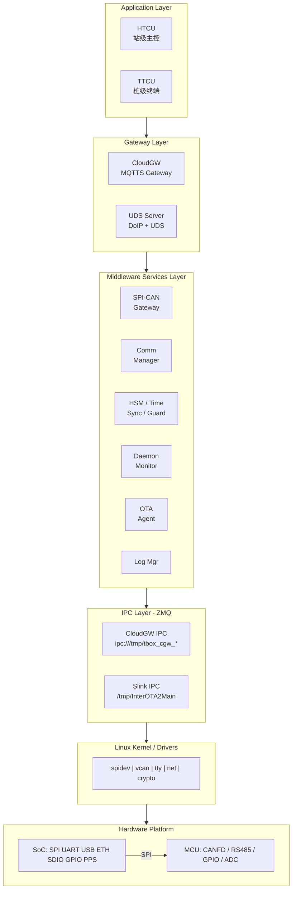
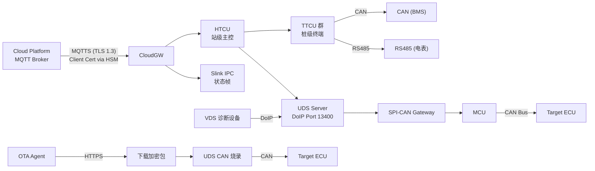

# TBox 平台总纲

> 本文档是 TBox 系统架构的**唯一入口索引**，列出所有子系统的角色、文档引用和相互依赖关系。
> 新成员应从本文档开始，按硬件→中间件→应用层的顺序阅读各子系统文档。

---

## 1. 文档地图

```
platform.md (本文档) — 平台总纲
│
├─ hardware.md      — 硬件能力框架 (SoC + MCU 双处理器)
│
├─ middleware.md    — 中间件服务架构 (IPC / 守护 / 通信 / 安全 / 时间)
│
├─ Slink.md         — 本地进程间通信 (ZMQ IPC 域划分)
├─ CloudGW.md       — 云端网关 (MQTTS + ZMQ 桥接)
│
├─ UDS.md           — 统一诊断服务 (DoIP + UDS + CAN 路由)
├─ OTA.md           — 远程升级框架 (下载→烧录→回滚)
│
├─ HTCU.md          — 充电桩站级主控 (功率分配 / 储能 / 安全)
├─ TTCU.md          — 充电桩终端应用 (充放电 / 计量 / 计费)
│
├─ (Extendable)     — 后续可按需扩展新模块
```

---

## 2. 系统分层

```
 ┌───────────────────────────────────────────────────────┐
 │                  Application Layer                     │
 │  ┌────────────┐  ┌──────────────┐  ┌──────────────┐   │
 │  │ HTCU       │  │ TTCU         │  │ ...          │   │
 │  │ (站级主控)  │  │ (桩级终端)   │  │              │   │
 │  └─────┬──────┘  └──────┬───────┘  └──────────────┘   │
 │        │                │                              │
 ├────────┼────────────────┼──────────────────────────────┤
 │  ┌─────┴──────────────┬─┴──────────────┐              │
 │  │  CloudGW           │  UDS Server     │              │
 │  │  (MQTTS Gateway)   │  (DoIP + UDS)   │              │
 │  └────────┬───────────┴────────┬───────┘              │
 │           │                    │                       │
 │  ┌────────┴────────────────────┴─────────────────┐    │
 │  │          Middleware Services Layer              │    │
 │  │                                                │    │
 │  │  ┌──────────┐ ┌──────────┐ ┌───────────────┐ │    │
 │  │  │ SPI-CAN  │ │ Comm     │ │ HSM / Time    │ │    │
 │  │  │ Gateway  │ │ Manager  │ │ Sync / Guard  │ │    │
 │  │  └──────────┘ └──────────┘ └───────────────┘ │    │
 │  │  ┌──────────┐ ┌──────────┐ ┌───────────────┐ │    │
 │  │  │ Daemon   │ │ OTA      │ │ Log / ...     │ │    │
 │  │  │ Monitor  │ │ Agent    │ │               │ │    │
 │  │  └──────────┘ └──────────┘ └───────────────┘ │    │
 │  └────────────────────────────────────────────────┘    │
 ├────────────────────────────────────────────────────────┤
 │                   IPC Layer (ZMQ)                      │
 │  ┌─────────────────┐  ┌──────────────────────────────┐ │
 │  │ CloudGW IPC 域   │  │ Slink IPC 域                 │ │
 │  │ CLOUD_GW_*       │  │ /tmp/InterOTA2Main           │ │
 │  └─────────────────┘  └──────────────────────────────┘ │
 ├────────────────────────────────────────────────────────┤
 │                 Linux Kernel / Drivers                  │
 ├────────────────────────────────────────────────────────┤
 │                  Hardware Platform                      │
 │  SoC: SPI UART USB Ethernet SDIO GPIO PPS            │
 │       └── SPI ──→ MCU ──→ CANFD / RS485 / GPIO / ADC │
 └────────────────────────────────────────────────────────┘
```



---

## 3. 模块职责一览

| 模块　　　　　 | 文档　　　　　　| 角色　　　　　　　　　　　　　 | 关键外部接口　　　　　　　　　　　　　　　　|
| ----------------| -----------------| --------------------------------| ---------------------------------------------|
| **Hardware**　 | `hardware.md`　 | SoC+MCU 双处理器，硬件能力矩阵 | — (提供者)　　　　　　　　　　　　　　　　　|
| **Middleware** | `middleware.md` | 服务编排 + IPC 总线　　　　　　| 启动 Daemon Monitor → 按序拉起所有服务　　　|
| **Slink**　　　| `Slink.md`　　　| 本地 ZMQ IPC 域管理　　　　　　| `/tmp/Inter*` 命名通道　　　　　　　　　　　|
| **CloudGW**　　| `CloudGW.md`　　| MQTTS → ZMQ 桥接网关　　　　　 | `ipc:///tmp/tbox_cgw_*.ipc` (4 socket)　　　|
| **UDS**　　　　| `UDS.md`　　　　| DoIP 边缘节点 + UDS 协议栈　　 | Port 13400 (外接 VDS), vcan0 (内接 ECU)　　 |
| **OTA**　　　　| `OTA.md`　　　　| 远程升级全生命周期　　　　　　 | HTTPS 下载 → UDS CAN 烧录 → 回滚　　　　　　|
| **HTCU**　　　 | `HTCU.md`　　　 | 充电站级主控　　　　　　　　　 | MQTTS(CloudGW), ETH(TTCU 群), CAN(储能 BMS) |
| **TTCU**　　　 | `TTCU.md`　　　 | 充电桩终端　　　　　　　　　　 | ETH(HTCU), SocketCAN(BMS), RS485(电表)　　　|

---

## 4. 数据流总图

```
Cloud Platform (MQTT Broker)
        │ MQTTS (TLS 1.3, Client Cert via HSM)
        ▼
┌──────────────────────────────────────────────────────────────────┐
│  CloudGW ──→ HTCU ──→ TTCU群 ──→ CAN(BMS) / RS485(电表)        │
│    │                                    │           │             │
│    │         ┌──────────────────────────┘           │             │
│    ▼         ▼                                      ▼             │
│  Slink IPC   UDS Server (DoIP Port 13400)       充电桩            │
│  (状态帧)     │ (外接 VDS 诊断设备)                              │
│               ▼                                                  │
│         SPI-CAN Gateway ──→ MCU ──→ CAN Bus ──→ Target ECU       │
│                                                                   │
│  OTA Agent ──HTTPS──→ 下载加密包 ──→ UDS CAN 烧录 ──→ Target ECU │
└──────────────────────────────────────────────────────────────────┘
```



---

## 5. 修订记录

| 版本 | 日期 | 修改内容 | 修改人 |
|------|------|---------|--------|
| v0.1 | — | 初版平台总纲 | — |
